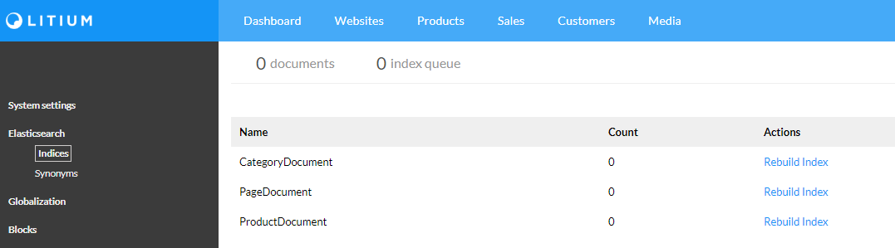

# Elastic search

**Elastic search is only avaliable in Litium version 7.4 and later**

> To do this task you first need to complete the tasks [Move site to IIS](../Move%20site%20to%20IIS) and [Docker](../Docker)

## Configure Litium to use Elastic search

Below steps are taken from the [Elastic documentation on docs-site](https://docs.litium.com/documentation/architecture/search/elasticsearch/setup-and-configure-elasticsearch)

First add the Elastic search connectionstring to _Web.config_:
```XML
<connectionStrings>
    <add name="ElasticsearchConnectionString" connectionString="http://localhost:9200" />      
```

With Elastic in place we need to update configuration:

1. Set a prefix so that multiple Litium-installations can share our Elastic cluster
1. [Disable Lucene-indexing for PIM and CMS](https://docs.litium.com/documentation/architecture/search/elasticsearch/disable-search-index-of-the-inbuilt-lucene-net)
1. Define symbol loading
    
Add the following appSettings to Web.config:
```XML
<appSettings>
    <!--Disable Lucene-indexing for PIM and CMS-->
    <add key="Litium:Search:Indexing:Product" value="false" />
    <add key="Litium:Search:Indexing:Website" value="false" />
    <!--Set a prefix for this Litiumsite, allowing us to use the same Elastic setup for multiple sites-->
    <add key="Litium:Elasticsearch:Prefix" value="litiumeducation" />
    <!--The local domain where search synonyms are loaded from -->
    <add key="Litium:Elasticsearch:Synonym:Host" value="http://host.docker.internal:8050" />
```

The `Litium:Elasticsearch:Synonym:Host` key defined above is a url that will be called _by Elastic search from the Elastic docker container_. For this to work we are using `host.docker.internal` which is a [special DNS name](https://docs.docker.com/docker-for-windows/networking/) used to call out from a container to its hosting environment. We define it to connect on port `8050` so add a binding to your website in IIS:


> If you run multiple Litium sites on your computer then use a unique port for each website!

## Test

1. When the site has restarted the **Elastic** menu option is avaliable in Litium backoffice, select it and rebuild all indices (the rebuild can be tracked in the _elastic.log_ file in your solution-directory):
   
1. Open your public website and verify that the search is working

### Finding problems

There are in general three places to look for any issue that you experience during setup and test:

1. Litium event log - found as the file _litium.log_ in solution folder
1. Litium elastic log - found as the file _elastic.log_ in solution folder
1. Elastic log in docker - run the following command to get logs from the last minute:
    ```console
    docker logs --since 1m elasticsearch
    ```
    Additional documentation on options for `docker logs` can be found at https://docs.docker.com/engine/reference/commandline/logs/
