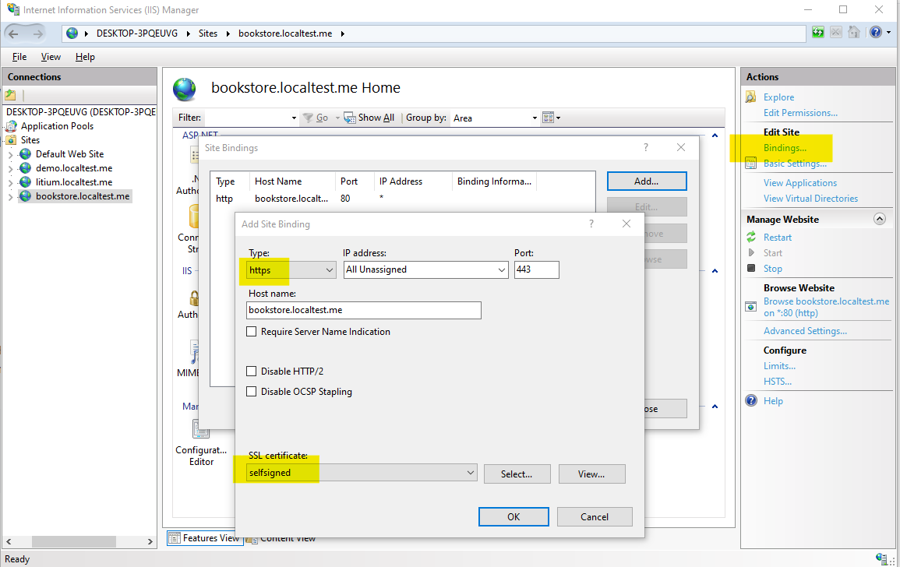

# Move website from localhost to IIS

> To do this task you first need to complete the task [Move database to SQL Server](../Move%20database%20to%20SQL%20Server)

1. Setup new website in IIS
    1. It should point to the `\Src\Litium.Accelerator.Mvc`-folder
    1. Select the same domain as you did when you deployed your accelerator (if you do not remember the domain it can be found in Control panel > Globalization > Domain names)
1. Adjust host-file (if you used a `localtest.me`-domain [this step can be skipped](http://readme.localtest.me/))
1. If you you get a database connection error in this step:
    1. If use used the connectionstring above with `Integrated Security=True` you can
        1. Setup a login in SQL Server and change connectionstring to provide credentials: `connectionString="Pooling=true;User Id=;Password=;Database=;Server=(local)\SQL2017"`
        1. OR edit advanced settings of your Application Pool in IIS and for _Identiy_ set custom account and login with your windows user
    1. If you are using a connectionstring with specified username and password:
        * Does your SQL Server have **SQL Server and Windows authentication** enabled in security settings?
        * Is the user specified not owner of the Litium database?
        * Is credential correct? Copy values from web.config and update the login in SQL Server
        
## Optional extra task - HTTPS

Follow the steps below to also enable `https`:

### 1. Add IIS Certificate and Binding

1. Open IIS Manager and on the Root/Home view select _Server Certificates_
    1. Click _Create Self-Signed Certificate_
    1. Use any name and save
1. Select your website in the left menu and click _Bindings_ in the right column and add a new binding with your new certificate:
        

Read more: https://weblogs.asp.net/scottgu/tip-trick-enabling-ssl-on-iis7-using-self-signed-certificates

### 2. Redirect Litium traffic over `https`

Just enabling https in IIS does not force traffic to use it, so you can still access your site with http. To fix that just login to Litium backoffice and in the control panel set _HSTS max age_ for your websites domain:

HSTS is the time, in seconds, that the browser should remember that a site is only to be accessed using `https`. Litium does not include subdomains in the HSTS-setting so each subdomain require its own domain entered.

Set the value to a few minutes during development and over a year in production. The Chrome browser for example requires minimum 1 year to be allowed in its preloaded list of HTTPS only websites

Read more at https://www.chromium.org/hsts

## Optional extra task - Second Channel Domain

1. Add a secondd domainname in Litium control panel
1. Create a new channel and connect it to your website and use your new domain name, optionally use different language/currency/payment settings on your new channel
1. In CMS make sure that at least the startpage is connected to your channel
1. Add the new domain as a binding on your website in IIS
1. Browse your website on your new domain
1. Experiment with publishing different pages, blocks and products to the different channels