layout: true
name: section
class: center, top, section-background

<div>
    
</div>

---

template: section
# Developer Education
.footer[
Use the arrow-keys to navigate the slides or click the icon in bottom-right corner to open the overview
]

---

layout: true
name: acceleratorproject


# Accelerator solution structure

.left-col[
### Projects

1. `Litium.Accelerator`

1. `Litium.Accelerator.Administration.Extensions`

1. `Litium.Accelerator.Elasticsearch`

1. `Litium.Accelerator.FieldTypes`

1. `Litium.Accelerator.Mvc`

1. _`Litium.Accelerator.Email` - "hidden" in solution folder_
]

.right-col[
    {{content}}
]

.footer[Read more https://docs.litium.com/documentation/litium-accelerators/develop/accelerator-architecture/accelerator-mvc]

---

layout: true
name: task
class: center, top


# Development task

All tasks are available at [github.com/LitiumAB](https://github.com/LitiumAB/Education/tree/main/Developer%20Education)
<br />(in Education/Developer Education/Tasks)


### Complete the task: 

{{content}}

---

layout: true
name: default


---
name: Agenda

.left-col[
## Agenda day 1

* About Litium

* Litium Accelerator

* Installation

* Demo Accelerator frontend and Litium Backoffice

* Field framework

* Litium area Websites

* Globalization

* Architecture and development

* SecurityContextService
]
--
.right-col[
## Agenda day 2

* Litium area PIM

* Logging

* Events

* Validation

* Litium APIs

* Add-Ons

* Litium Search

* Litium area Sales

* Accelerator front-end development

]
---
class: center

# Goal

> The goal of this education is to make you a confident and independent  
> developer, ready to **participate** in Litium projects.
>
> You will know how to setup Litium, implement most requirements,  
> and know where to find answers when you don´t.

---
# Litium areas and features

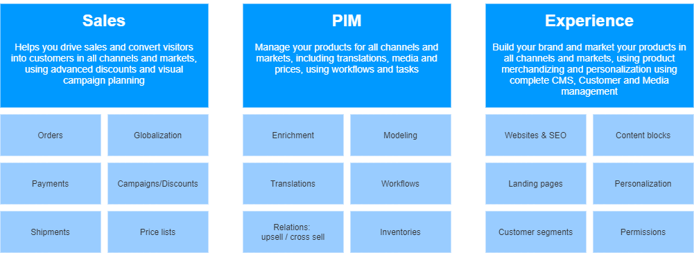

???

background-image: url(images/features.png)

---

# Litium tech stack

* [React](https://reactjs.org/) (Accelerator) and [Angular](https://angular.io/) (Litium administration UI)

* Litium CDN _Powered by [Fastly](https://www.fastly.com/)_

* [Microsoft .NET MVC](https://dotnet.microsoft.com/apps/aspnet/mvc)

* [Microsoft .NET 6](https://dotnet.microsoft.com/)

* Litium search _Powered by [Elasticsearch](https://www.elastic.co/)_

* [Redis](https://redis.io/)

* [Microsoft SQL Server](https://www.microsoft.com/en-us/sql-server)

* [Docker](https://www.docker.com/)

---
# Roadmap

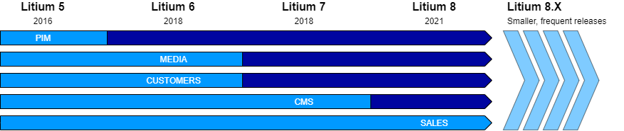

--

### Coming functionality

Roadmap: https://docs.litium.com/documentation/roadmap
---

template: section

# Litium Accelerator

---

# What is Litium Accelerator?

* A packaged technical solution

    * Includes core e-commerce functionality: Cart, My pages, Up/Cross sell, Checkout, Search/Filtering, Landing pages

    * Get started with new projects faster

    * Projects can add value, not boilerplate

* Delivered as source code

    * Modify or remove included functionality

* Start with current code snapshot and once customized the accelerator will be part of the solution

---
# Litium Accelerator

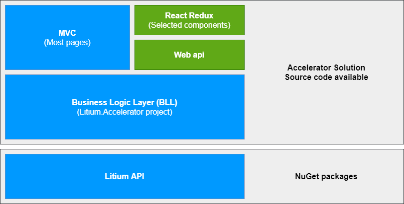

.footer[Read more at https://docs.litium.com/documentation/litium-accelerators/develop/accelerator-architecture]

???

BLL Allows the same business logic to be used in both Web API and in MVC Views

---

template: acceleratorproject

---

template: acceleratorproject

### 1. Litium.Accelerator

- BLL - Contains all business logic of the accelerator, separated from the UI and Web API, example:

   - ViewModels and ViewModelBuilders
   - Definitions
   - Services
   - Validations

- Talks to the Litium API (installed via NuGet)

---

template: acceleratorproject

### 2. Litium.Accelerator.Administration.Extensions

- Extend Litium backoffice UI

- [Create custom settings pages](https://docs.litium.com/documentation/architecture/back-office_1/creating-custom-setting-page)

---

template: acceleratorproject

### 3. Litium.Accelerator.Elasticsearch

- Contains the Elasticsearch implementation

- Modify what data is stored in the index

- Modify how queries are executed against the index data

---

template: acceleratorproject

### 4. Litium.Accelerator.FieldTypes

- Custom field types for Litiums entity field framework

---

template: acceleratorproject

### 5. Litium.Accelerator.Mvc

- MVC _Controllers_ and _Razor Views_

- Web API controllers for the Accelerator React UI

- `/Definitions`-folder to manage connections between Field Templates and the controller to use for rendering

- `/Client`-folder containing all client styles and JavaScript

- Configuration and package reference files

---

template: acceleratorproject

### 6. Litium.Accelerator.Email

- [Client side project to manage e-mail templates](https://docs.litium.com/documentation/litium-accelerators/develop/front-end-accelerator/accelerator-email) (Order confirmation e-mail)

- [Zurb Foundation for Emails](https://get.foundation/emails/docs/) used for styling

---

template: section

# Installation

---

# Installation

.footer[Read more at https://docs.litium.com/documentation/litium-accelerators/install-litium-accelerator]

## Litium platform is only distributed through a private NuGet-feed

* The NuGet-feed is accessed using your [Litium Docs](http://docs.litium.com) user account

--

## Litium Accelerator is distributed as a .NET template package

```PowerShell
# Install the Accelerator template package
dotnet new --install "Litium.Accelerator.Templates"

# Install Accelerator using the template package
# (also downloads the Litium platform dependencies from NuGet)
dotnet new litmvcacc
```

---

# Installation prerequisites

System requirements for local development environment are avaliable on [Litium Docs site](https://docs.litium.com/documentation/get-started/system-requirements)

| Requirement | Details |
| :-- | :-- |
| .NET 6 | |
| Visual Studio 2022 | |
| Docker | |
| Elasticsearch | |
| Microsoft SQL Server 2019 | Local or container |
| Litium NuGet and Container access | Setup access, requires partner account on docs.litium.com | |
| Payment app | Required to place order in checkout |
| Shipment app | Required to place order in checkout |
| Redis | Not required to run but recommended |

---
# litium-db tool

Command-line dotnet tool to work with the Litium application database

* New from Litium 8

* [Create admin users](https://docs.litium.com/documentation/get-started/create-admin-user-and-log-in) in database

* Setup new Litium application database

* Migrate database to new version during upgrade

* Generate scripts for manual upgrade

.footer[Read more at https://docs.litium.com/documentation/get-started/database-management]

---
template: task
name: Task: Developer certificate

# Developer certificate

---
template: task
name: Task: Docker

# Docker

---
template: task
name: Task: Installation

# Installation

---
template: task
name: Task: Litium search

# Litium search

---

template: section

# Installation review

---

# appsettings.json

* Connectionstrings for database, Elasticsearch and Redis

* Files folder

  * Temporary files

  * Media files

  * Use the `Shared`-folder in multi server environment

* SMTP

.footer[Read more at https://docs.litium.com/documentation/get-started/configuration]

---

template: section

# Demo: Litium Accelerator Front-end

???

Go through the deployed storefront of Litium Accelerator and show briefly what it includes

* Mega menu
* Categories
    * Category filter
* Search
    * Search filter
* Product page
    * Place item in cart
* Checkout
    * Place order with user registration

---

background-image: url(images/backoffice-ui.png)

# Litium Backoffice

**Login URL: http<span>://</span>mydomain/litium**

* Use Litium db-tool to generate admin users

* Angular

* Developer extension points:

  * Dashboard widgets

  * Entity custom fields

  * Area-panels

  * Pages in control panel

---

# Accelerator – What is deployed?

1. New site in websites area

1. New assortment in PIM

1. Templates and fields for PIM, Websites, Customers and Blocks 

1. Globalization artifacts
    * Channel
    * Country
    * Currency
    * Domain name
    * Market
    * Tax class

---
template: section
# Demo: Litium Backoffice

???
1. Show the dashboard and default widgets
1. Show control panel
    1. Globalization
    1. Editing a field and a template
1. Very briefly show Media
1. View the order created earlier in front-end demo
1. View the person created with the placed order
1. Go through PIM
    1. Base product and variants
    1. Prices 
    1. Stock balances
    1. Publishing to channel
1. Show Websites
    1. Publishing to channel
    1. Blocks


---
template:section
# Data Modelling

---

# Entities

### The following Litium entities support data modelling with the field framework

| PIM | Customers | Websites | Media | Globalization | 
| :-: | :-: | :-: | :-: | :-: |
| Product | Person | Website | Media | Market |
| Category | Group | Page | Folder | Channel |
| | Organization | Block |

???

With Litium 8 additional entities from E-commerce will be added

---

# Field Framework - Fields

* Developers can [create their own field types](https://docs.litium.com/documentation/architecture/field-framework/creating-a-custom-field-type) 

* A **Field type** is available in all **Areas** of the **Installation**

* Instances of a **Field type** are created per **Area**

--

.box[
  _Example: The field **City** is of type **Text** and is created in the **Customers-area**_

  _Example: The field **Brand** is also of type **Text** and is created in the **Products-area**_
]

---

# Field Framework - Field templates

* An entity (for example a Person, Product or Page) is created using a Field template

* A Field template contains fields

* A Field does not need to be part of the entitys Field template to be added to the entity

  * The Field template is **not** the link between the Field and the entity - it only controls field visibility when editing the entity in UI

  * Skip adding a field to a template to make it hidden for editors

---

# Field Definition

## Defined per Area

* `Litium.WebSites.WebSiteArea`
* `Litium.Products.ProductArea`
* `Litium.Customers.CustomerArea`
* `Litium.Blocks.BlockArea`

Definitions are in `\Src\Litium.Accelerator\Definitions\`

Example:
```C#
new FieldDefinition<CustomerArea>("SocialSecurityNumber", SystemFieldTypeConstants.Text)
{
    CanBeGridColumn = true,
    CanBeGridFilter = true,
    MultiCulture = false,
}
```

---
# Field template

1. _Fields_ are added to _field groups_

1. _Field groups_ are added to _field templates_

```C#
new PersonFieldTemplate("MyPersonTemplate")
{
    FieldGroups = new []
    {
        new FieldTemplateFieldGroup()
        {
            Id = "General",
            Collapsed = false,
            Fields =
            {
                SystemFieldDefinitionConstants.FirstName,
                SystemFieldDefinitionConstants.LastName,
                SystemFieldDefinitionConstants.Email,
                "SocialSecurityNumber"
            }
        }
    }
}
```

---
# Pointer field type

* A field type that points to other entities

* Single or multi select

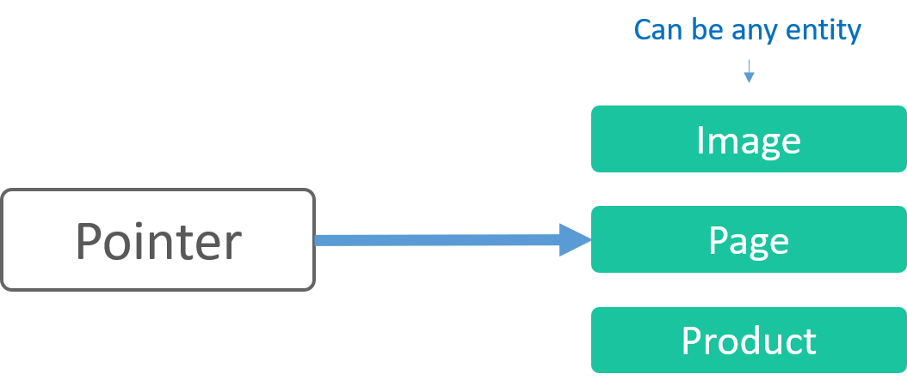

```C#
new FieldDefinition<BlockArea>(BlockFieldNameConstants.Link, 
    SystemFieldTypeConstants.Pointer)
{
    Option = new PointerOption { EntityType = PointerTypeConstants.WebsitesPage }
}
```

---
# Multi field

.left-col[
* A field that is a container for other fields

* The only field that can be used as array
]

.right-col.right[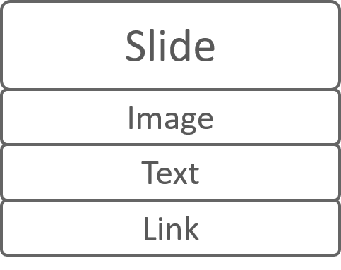]

.full-col[
```C#
new FieldDefinition<BlockArea>(FieldConstants.Slide, 
    SystemFieldTypeConstants.MultiField)
{
    Option = new MultiFieldOption { 
        IsArray = true, 
        Fields = new List<string>() { 
            FieldNameConstants.ImagePointer, 
            FieldNameConstants.LinkText,
            FieldNameConstants.LinkToPage
        } 
    }
}
```
]

---

# Entity Model

* Each entity has its own “entity service”

* Use the service to get, create, update or delete entities

```C#
public abstract class ChannelService : IEntityService<Channel>, 
    IEntityAllService<Channel>
{
    protected ChannelService();

    public abstract void Create([NotNull] Channel channel);

    public abstract void Delete([NotNull] Channel channel);

    public abstract Channel Get(Guid systemId);
    public abstract Channel Get([NotNull] string id);
    public abstract IEnumerable<Channel> Get([NotNull] IEnumerable<Guid> systemIds);
    public abstract IEnumerable<Channel> GetAll();

    public abstract void Update([NotNull] Channel channel);
}
```

---
# Entity model - Updating an entity

1. Create an updatable copy by calling `MakeWritableClone()` on the entity _(objects are read only because cached entities should be non modifiable)_

1. Update the clone and call the update method of the respective entity service

    ```C#
    person = person.MakeWritableClone();

    person.LoginCredential.NewPassword = newPassword;

    _personService.Update(person);
    ```

???

Makewriteableclone
* Creates a clone of the object in cache
* All items are read only when fetched
* The writeable object replaces read-only item in cache

---
# Entity model - Relationships between entities

Domain model relationships:

- **entity – entity** when both entities can exist independently

- **parent entity – child entity** when a child cannot exist without its parent _(example baseproduct – variant)_

- Connected with _Link_-objects

    - The link has the SystemIds of both entities

    - The link may have additional information related to the relationship

---
# Entity model - Relationships between entities

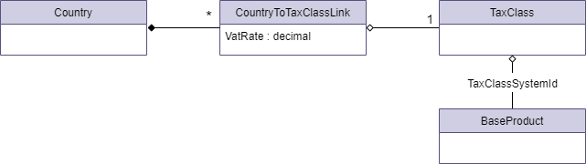

```C#
var link = new CountryToTaxClassLink(taxClass.SystemId);
link.VatRate = vatRate; // The link can have additional information related to the relationship

country.TaxClassLinks.Add(link);
_countryService.Update((Country)country);
```

### A TaxClass can exist on its own, but CountryToTaxClassLink needs a Country to exist

Implication: TaxClass has its own TaxClassService, but there is no _CountryToTaxClassLinkService_

???

* A country does not have a tax class object

* Entities are connected with a link-object that can have its own data

* Similar to a connecting-table in SQL Server

---

# Automapper
A convention-based object-object mapper.

### What is AutoMapper?

> “Object-object mapping works by transforming an input object of one type into an output object of a different type.”

### Why use AutoMapper?

> "Mapping code is boring. Testing mapping code is even more boring. AutoMapper provides simple configuration of types, as well as simple testing of mappings."

.footer[
http://docs.automapper.org/en/stable/Getting-started.html
]

---

# Automapper

### Register
```C#
cfg.CreateMap<PageModel, ArticleViewModel>()
    .ForMember(x => x.Title, m => m.MapFromField(PageFieldNameConstants.Title))
    .ForMember(x => x.Text, m => m.MapFromField(PageFieldNameConstants.Text))
    .ForMember(x => x.Image, m => m.MapFrom<ImageModelResolver>());
```

### Use
```C#
var articleViewModel = pageModel.MapTo<ArticleViewModel>();
```

.footer[
http://docs.automapper.org/
]

---
template:section
# Area: Websites

---

# Websites domain model

* Pages can be “active” in different channels
* A `DraftPage` is the working copy of a Page (a page can only have a single `DraftPage`)

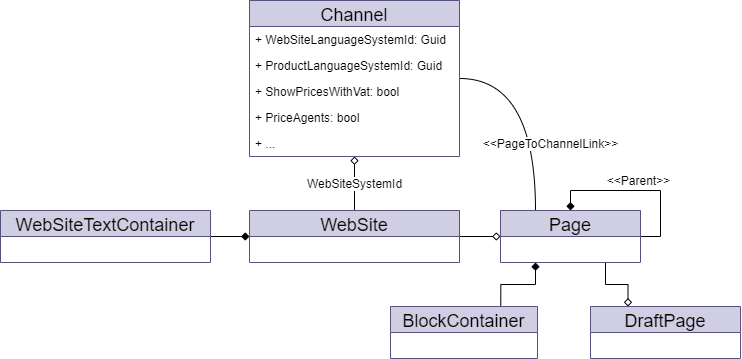

---

# Blocks

* Have data modelling

* Rendered inside a BlockContainer of a page

* Rendered as [view components](https://docs.microsoft.com/en-us/aspnet/core/mvc/views/view-components)

* Allow editors to easily change the page structure without developer involvement

* A Block can be Global or Local

    * **Local:** a page has its own instance of a block

    * **Global:** the block has a reference to a single global instance that can be used on multiple pages
    

---
template: task
name: Task: Author page
# Author page

---
template:section
# Area: Globalization

---

# Litium.Globalization

### Entities that are common across areas

* DomainName

* TaxClass

* Language

* Currency

* Country

* Channel (has field framework)

* Market (has field framework)

---

# Market

* Programmatically a market is a group of channels

* Supports data modelling (has the field framework)

* **Products** are sold in a **market** through different **channels**

--

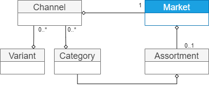

---

# Channel

* Has domain names

* Belongs to a market

* **May** have a website

* Sets website and PIM language

* Can have multiple countries

* Supports data modelling

--

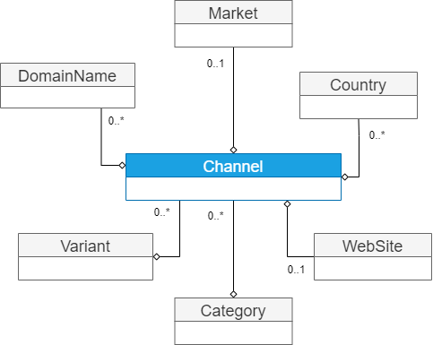

---
# Country & Tax class

* Products have a _Tax class_

* VAT percentage for _Tax class_ is defined per Country

* All products with the same tax class have the same VAT percentage


---
template: section
# Architecture

---
# Component model - Implementations

* **Abstractions** (interfaces/abstract classes) are separated from  **implementations** in different assemblies

--

* All default **implementations** have a `Impl`-suffix and the `fallback`-attribute:
    ```C#
    [Service(FallbackService = true)]
    [RequireServiceImplementation]
    public class PriceCalculatorImpl : IPriceCalculator
    ```
--

    * `Litium.Products.PriceCalculator.IPriceCalculator` is located in the `Litium.Abstractions` assembly
--

    * `Litium.Application.Products.PriceCalculatorImpl` located in the `Litium.Application` assembly.
--
* `RequireServiceImplementation`-attribute will prevent adding a reference to the _Abstraction_ without _Implementation_

---

# Component model - Abstractions

Abstractions are contracts that define functionality:

--

* Interfaces
    * Implement an interface to replace functionality

    * Or extend/change default functionality by using the [service decorator pattern](https://docs.litium.com/documentation/architecture/dependency-injection/service-decorator)
    
    * Example: `IPriceCalculator`

--

* Abstract Classes

    * Implementation projects are **not expected to change** abstract classes

    * Example: Service-classes are used for most functionality and to access and work with entities (BaseProductService, VariantService etc.).

--

### Only reference **abstractions** during development for better testability

---
# Redis

> _"An open source, in-memory data structure store, used as a database, cache and message broker"_

### Redis is used in Litium for:

* Distributed cache

* Distributed lock

* Service bus

* Session information

---

# Redis Distributed Cache

Cache outside the Litium application

* Does not clear when the site restarts

* Faster than database

* Reduces database usage

.footer[An optional development task for distributed cache is avaliable in the [Redis-task](https://github.com/LitiumAB/Education/tree/main/Developer%20Education/Tasks/Redis#1-distributed-cache)]

???

Redis cache is second line to a short in memory 2-minute cache, for high performance and low memory usage

Improvements in application startup from 3 minutes to 30 seconds

---

# Distributed lock

Use a _distributed lock_ to prevent other applications and threads from accessing a section of code that should not have multiple simultaneous executions.

The code inside the lock will only run on one server (i.e. one application instance), all other instances will either wait or timeout.

```C#
using (_distributedLockService.AcquireLock(key, TimeSpan.FromSeconds(10)))
{
    // Tip: the Redis-task has a subtask for working with distributed lock
}
```

.footer[An optional development task for distributed lock is avaliable in the [Redis-task](https://github.com/LitiumAB/Education/tree/main/Developer%20Education/Tasks/Redis#2-distributed-lock)]

???

### Concurrency
The optimistic concurrency control approach doesn't actually lock anything - instead, it asks User A to remember what the row looked like when he first saw it, and when it's time to update it, the user asks the database to go ahead only if the row still looks like he remembers it. 

https://blogs.msdn.microsoft.com/marcelolr/2010/07/16/optimistic-and-pessimistic-concurrency-a-simple-explanation/

### Distributed lock
With Redis, we use the well proven Redlock algorithm to achieve locking, with very high performance and stability, to make sure that only one order is created for the same payment

---
template: section
# Dependency injection
---
# Dependency injection

### Dependency injection for five-year-olds
> When you go and get things out of the refrigerator for yourself, you can cause problems. You might leave the door open, you might get something Mommy or Daddy doesn't want you to have. You might even be looking for something we don't even have or which has expired.

> *What you should be doing is stating a need*, "I need something to drink with lunch," and then we will make sure you have something when you sit down to eat.

_John Munsch, 28 October 2009._

From https://en.wikipedia.org/wiki/Dependency_injection

---
# Using dependency injection in Litium

```C#
public class Waiter
{
    public Waiter(IDessert dessert)
    {
        dessert.Serve();
    }
}

// This attribute handles the entire dependency injection registration
[Service(ServiceType = typeof(IDessert))]
public interface IDessert
{
    void Serve();
}

public class IceCream : IDessert
{
    public void Serve()
    {
        // Serve some ice cream
    }
}
```

[Read more on Litium Docs](https://docs.litium.com/documentation/architecture/dependency-injection/service-registration)

---
# Dependency injection lifetime

```C#
[Service(ServiceType = typeof(IDessert), Lifetime = DependencyLifetime.Singleton)]
public abstract class StockService
{
    // ...
}


```

* **Singleton:** Clients will always receive that same instance from the container

* **Scoped:** The same instance is used within the scope

    * The entire web request

    * The execution of a scheduled task

* **Transient:** A new instance of the component will be created each time the service is requested from the container

???

### Risks with DI

* Classes are selected during runtime making it harder to see what code is executing

* Using a scoped or transient service inside a singleton may cause issues with state being stored longer than expected

---
template: task
name: Task: Author service
# Author service

???

# Optional implementation 
The recommended way to implement this is to set the Books-property using automapper. 

It is slightly more complex and therefore not used in task.

In the mapping call a custom valueresolver:
```C#
cfg.CreateMap<PageModel, AuthorViewModel>()
    // ...
    .ForMember(x => x.Books, m => m.MapFrom<BookResolver>());
```
Define valueresolver:
```C#
[UsedImplicitly]
protected class BookResolver : IValueResolver<PageModel, AuthorViewModel, List<string>>
{
    private readonly IAuthorService _authorService;

    public BookResolver(IAuthorService authorService)
    {
        _authorService = authorService;
    }

    public List<string> Resolve(PageModel source, AuthorViewModel authorViewModel, List<string> destMember, ResolutionContext context)
    {
        return _authorService.GetBooksByAuthor(source.SystemId);
    }
}
```

---
# Service Decorator

* To change or replace default implementation

    * Usually to inject business logic

    * “Strategy pattern” in software design

* To inject new business logic

    * “Decorator pattern” in software design

* Advantages over “inheritance” (subclass)

    * Dynamically add/replace business logic

    * Reference Litium abstraction namespaces only

    * Extend without knowing which class implements interface

---
template: task
name: Task: Author service decorator
# Author service decorator

---
template: section
# SecurityContextService

---

# SecurityContextService

* Check login status

* Get currently logged in person from Customer area

* Alter permission context for code execution

--

```C#

var currentUserIsLoggedIn = _securityContextService.GetIdentityUserSystemId().HasValue;

if(currentUserIsLoggedIn) 
{
    var personSystemId = _securityContextService.GetIdentityUserSystemId();
    var currentlyLoggedInPerson = _personService.Get(personSystemId.Value);
}

```

---

# Current user and SecurityContextService

* Context of current user is always in all method calls, if no user is logged in code is executed as _Everyone_.

* Use `SecurityContextService` to alter current user for method calls:

    ```C#

    // Temporarily elevate permissions
    using (_securityContextService.ActAsSystem("My custom integration task"))
    {
        // Do stuff here that the current user cannot normally do
    }

    // Temporarily remove permissions (execute code as anonymous user even if logged in)
    using (_securityContextService.ActAsEveryone())
    {
        // Do stuff here that the need to be done without custom permissions
    }

    ```

---

# Impersonation with SecurityContextService

Use `SecurityContextService` to execute code as a specific user:

```C#
if (person != null && !string.IsNullOrEmpty(person.LoginCredential.Username))
{
    var claimsIdentity = _securityContextService.CreateClaimsIdentity(
                    person.LoginCredential.Username, person.SystemId);

    using (_securityContextService.ActAs(claimsIdentity))
    {
        // Do stuff here as any provided person
    }
}
```

???

The value passed as username will be used as name claim in the identity.

---
template: section
# Area: PIM
## Product Information Management

---
# Product structure

.left-col[
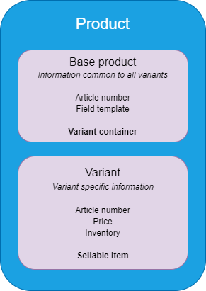
]

--

.right-col[
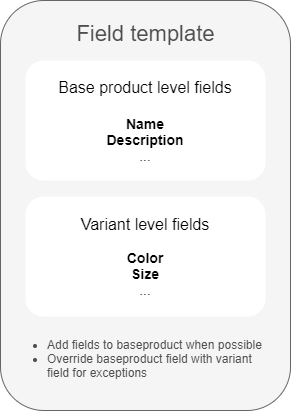
]

???

* The baseproduct is a container
* The variant is the buyable entity of the product
* Mention that price and stock is only set on the Variant
* Articlenumber is mandatory field on both base product and variant
* Fieldtemplates can have fields on both baseproduct and variant level

---
# PIM Data Model

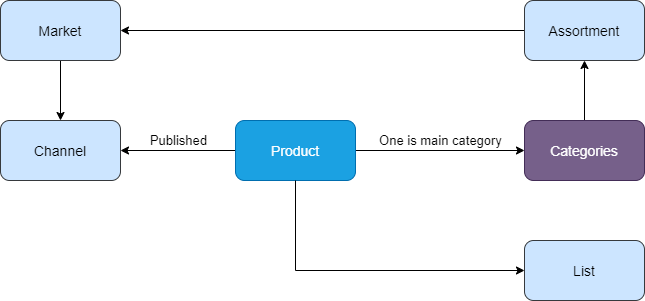


???

If multiple categories are connected then other categories have canonical to main category to avoid seo issues with duplicate content

A website can only be connected to one assortment, only products in that assortment will work with correct url’s

Show lists in Backoffice!
* A list can be used and published on a website
* A dynamic list is a static list with an event based engine that adds/removes items from the list 

---
# Relations between products and categories

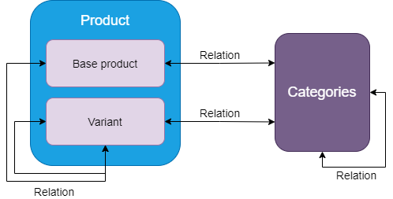

## Relationship types
* Directional “Accessories”
* Bi-directional “Similar products”

---
# Display templates

* Possible to define different templates per website

* Products can use either base product url or variant url

    * Defined on the display template

    * When variant url is used it is possible to manage how variants are grouped in listings

    * In Control _Panel > Accelerator_ the default implementation has a UI to select grouping field

---
# Common PIM extension points

### `IPriceCalculator`

Get price from ERP in complex B2B scenarios

### `IStockStatusCalculator`

Adjust so that package product inventory is the sum of its parts

---
template: task
name: Task: Pricing rules
# Pricing rules

---
template: section

# Logging

---
# Audit log

* Logging of updates in PIM

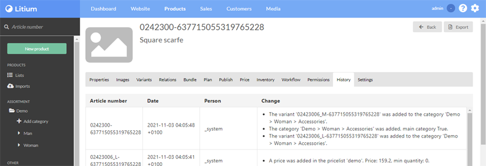

--

* Logging when users with access to customer or order area login to the system

    * This log has no UI
    * Available in _Auditing_-schema in DB

---
# Error handling

## All errors should be logged by the developer.
* Wrap with `try/catch` 

* Never `catch` without logging the exception

## Constructor inject `ILogger<Type>`

---
# Event log

* Managed in NLog.config

* Logging to textfiles, monitor with [Baretail](https://www.baremetalsoft.com/baretail/) during development:
    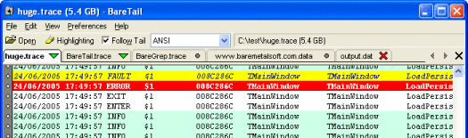

* Logging to console during development
    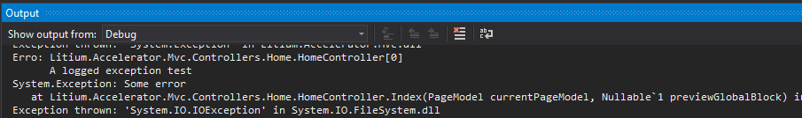


---
template: section
# Events

---
# Event system

.footer[https://docs.litium.com/documentation/architecture/events-handling]

* All events are handled by `Litium.Events.EventBroker` (publish/subscribe) - both custom and platform events.

--

* All events are local and triggered by the application

  * i.e. in multi server environments an event is triggered **on the current server only**.

  * Adjust scope when publishing an event to also send it to all servers via service bus

--

* You may modify the database (at own risk!) but this bypasses all change events

--

* Most events can be subscribed to from outside Litium using [Webhooks](https://docs.litium.com/documentation/architecture/events-handling/webhooks) - Use Get Filters in Litium Swagger for Webhooks to get a list of supported events


???

Events are used to sync cache and search index on every application/server

---
class: scrollable

# Creating a custom event

### Step 1: Declare the event class, typed with the object we need to pass:
```C#
// IMessage interface is required for the class
// to be sent as a Litium event
public class MyEvent : EventArgs<Currency>, IMessage
{
    public MyEvent(Currency item) : base(item)
    {

    }
}
```

### Step 2: Publish the event:
```C#
public class MyEventPublisher
{
    private readonly EventBroker _eventBroker;

    public MyEventPublisher(EventBroker eventBroker)
    {
        _eventBroker = eventBroker;
    }

    public void SendEvent()
    {
        _eventBroker.Publish(new MyEvent(new Currency("SEK")));
    }
}
```

### Step 3: Subscribe to the event and act when it occurs:
```C#
// The autostart attribute triggers the class on startup so that your subscription gets registered
[Autostart]
public class MyEventSubscriber : IAsyncAutostart
{
    private readonly IApplicationLifetime _applicationLifetime;
    private readonly EventBroker _eventBroker;
    private readonly ISubscription<MyEvent> _subscription;

    public MyEventSubscriber(EventBroker eventBroker,
        IApplicationLifetime applicationLifetime)
    {
        _eventBroker = eventBroker;
        _applicationLifetime = applicationLifetime;
    }

    public ValueTask StartAsync(CancellationToken cancellationToken)
    {
        // Register a subscription on the EventBroker
        var subscription = _eventBroker.Subscribe<MyEvent>(ev =>
        {
            // This code will execute every time MyEvent is published
            // Get the currencyobject from the event instance and act on the data
            var currency = ev.Item;
        });

        _applicationLifetime.ApplicationStopping.Register(() =>
        {
            // application is about to shutdown, unregister the event listener
            subscription.Dispose();
        });

        return ValueTask.CompletedTask;
    }
}
```

.small[
Read more<br />
https://docs.litium.com/documentation/architecture/events-handling/dot-net-events<br />
https://docs.litium.com/documentation/architecture/application-lifecycle
]

<br/>
<br/>

???

* Interface `IMessage` need to be implemented by all classes that should be send as an event on the Litium.Events.EventBroker

* Overload on `_eventBroker.Publish()` that accepts scope parameter to possibly send to all applications

---

# Service bus

* Used to send messages between applications.

* Event system use service bus in the background for global events.

* The queue is outside the application - Free up resources by running queue in the background

* Two different types of message queues

  * Queue – Same message queue for all applications, saved and processed even if application restarts

  * Topic – Unique queue for each application, exists as long as the application is connected

* Required in all multi-server solutions!

* Note: Servers are updated **“Near real time”**

.footer[https://docs.litium.com/documentation/architecture/service-bus]

???

* Local on application if no Service Bus is configured, can be used to develop locally without setting up service bus

* Application = A running Litium instance connected to the same database

* Example Queue: Update smart list content (in db-table) - only one server has to do the job

* Example Topic: Remove from cache (must be done on all servers)

* Tested:
  * Service bus in Microsoft Azure – 150 items/sec​
  * Redis in Microsoft Azure – 400 items/sec​
  * Redis in Litium Cloud – 5000 items/sec​

---
template: section

# Validation

---
# Business rules validation

```C#
public class ValidationExample : ValidationRuleBase<Currency>
{
    public override ValidationResult Validate(Currency entity, 
        ValidationMode validationMode, CultureInfo culture)
    {
        var result = new ValidationResult();
        if(entity.TextFormat != "C0")
        {
            result.AddError("TextFormat", "Need to be C0")
        }
        return result;
    }
}
```

* Inheriting `ValidationRuleBase` instead of `IValidationRule` gives a typed entity

* Inheriting `ValidationRuleBase` is enough to register the validation to be executed on every entity modification

???

The first parameter in AddError defines where the message is shown.
One validation can add multiple messages, example
```C#
result.AddError("AuthorField", "A author field error message");
result.AddError("Brand", "A brand field error message");
result.AddError("*", "A global error message shown at the top of the edit-page");
```


---
template: task
name: Task: Author field
# Author field

---
template: task
name: Task: Validation
# Validation

---
template: section
# Litium APIs

---
name: Litium APIs

# Litium APIs

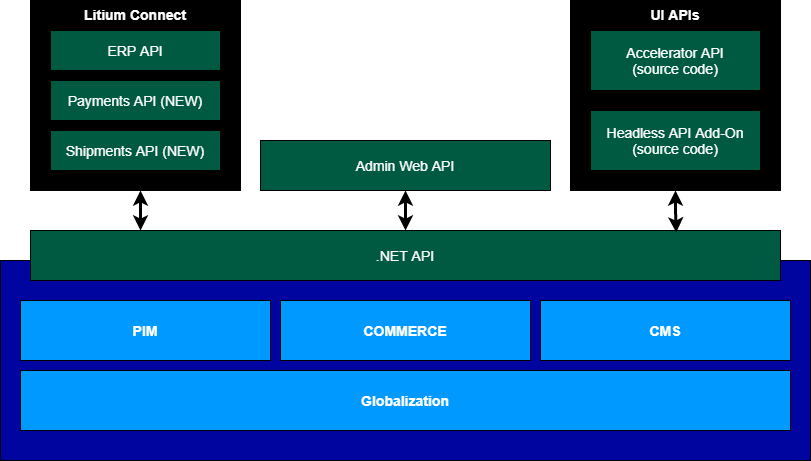


---
# Using Litium APIs

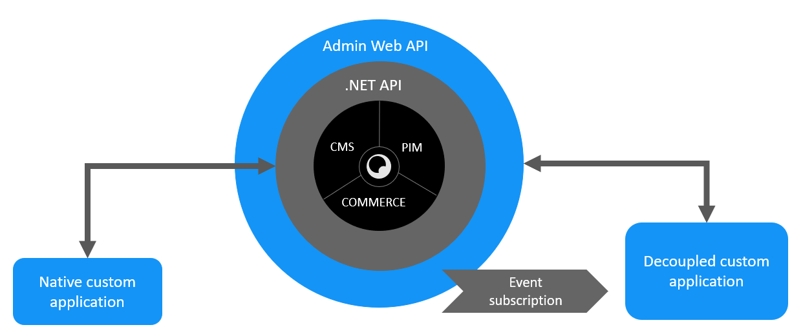

???

* Covers all entities
* Litium .NET API
* Litium Admin Web API
* Event subscription with Webhooks

---

# Litium connect

.left-col[
### What is it?

* Stand alone applications

* High level Web API interface

* Subscribe to Web hooks

* Guaranteed delivery

* Security with OAuth and Litium service accounts

* High performance
]

--

.right-col[
### Benefits

* Integrations as applications

* Deploy and scale without restarting Litium

]

???

Web hooks = Example, leave phonenumber to be called back in phone queue

Guaranteed delivery = Litium tries to deliver the message a few times before giving up 

---

# Litium connect versioning

Litium connect APIs have individual versioning:

.table-border[

| Litium platform | ERP API | Payments API | Shipments API | Channels API
| :-: | :-: | :-: | :-: | :-: |
| 7.4 | 1.0 | - | - | - |
| 7.6 | 2.0 | - | - | - |
| 7.7 | 2.0 | - | - | - |
| 8.0 | 2.0 | 1.0 | 1.0 | - |
| 8.X | 2.0 | 1.0 | 1.0 | 1.0 |

]

---
name: Litium Connect APIs

background-image: url(images/connect.png)

# Litium connect

---

# Web API

* Useful for

    * RESTful applications

    * Integration when server is communicating with other servers.

* Service Accounts – Access services without access to Litium Backend

* **OnlyJwtAuthorization** - attribute to restrict API endpoint to only use JSON Web Token (JWT)

* **OnlyServiceAccountAuthorization** – attribute to restrict API endpoint to only allow Service Accounts

.footer[Read more: https://docs.litium.com/documentation/architecture/web-api]

---
# Swagger API documentation

* Available at http://domain/litium/swagger (permission required)

* Covers Accelerator Web API, Litium Connect and Admin Web API

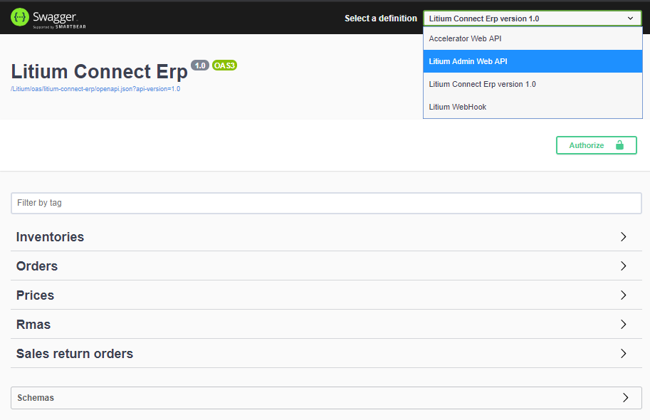

---
template: task
name: Task: Web API

# Web API

---
template: section
# Add-Ons

---

# Frequently used Add-Ons

.footer[Read more at https://docs.litium.com/add-ons]

* **Product Media Mapper**

    * Automatically connect images and files to products on upload

--

* **Payment providers**

    * Klarna, Dibs, PayEx, Adyen, PayPal, Nets, Handelsbanken Ecster, Skrill

--

* **Integration kit**

    * Starting platform to develop file based integrations towards Litium

--

*  **Headless API**

    * Starter kit to use Litium E-Commerce using Web API

    * Self documenting with [OpenApi/Swagger](https://docs.litium.com/documentation/add-ons/integration/litium-headless-api/configure/docs)

---
# Distribution – Add-Ons (and Accelerator)

* As **compiled Add-Ons** (e.g. Product Media Mapper)

    * Install via NuGet packages

    * Run as part of the Litium application

--

* As **source code Add-Ons**  (e.g. Headless API and Integration kit)

    * Download from https://docs.litium.com 

    * Usually run as part of the Litium application

--

* As **Litium Apps**  (e.g. payment and shipment providers)

    * Read more at https://docs.litium.com/documentation/litium-apps

    * Run as separate application

---

# Add-On Gotchas

*  The Litium platform and licensed Add-Ons (e.g. Accelerator and Integration Kit) can not be reused or shared after download

--

* All Add-Ons are not initially available for new Litium versions, check in advance


---
template: section
# Apps

---
# Litium Apps

* Run Litium Add-Ons as standalone applications

* Apps Creates their own [Litium Service Accounts](https://docs.litium.com/documentation/architecture/web-api/security) on install

    * Account key is sent to that app to store (cannot be resolved after create)

* Installed per customer project

* Payment and Shipment run as Apps from Litium 8

.footer[Read more at https://docs.litium.com/documentation/litium-apps]

---
template: section
# Searching & Batching

---
# Litium Search

Litium Search is built on Elasticsearch with additional plugins and administration interface

* One distributed search engine for all web servers

* Part of Litium Accelerator

.footer[Read more: https://docs.litium.com/documentation/architecture/litiumsearch]

???

It is possible to fine tune how the indexing of a item is made, and what fields to include​

The configuration options is not only for indexing, you also get full flexibility when searching, you can improve the importance of different fields and adjust how search result should be presented to match what the visitor expect.

---
# Litium Search

* Litium Accelerator includes indices for pages, categories and products

* Additional indices [can be added](https://docs.litium.com/documentation/architecture/litiumsearch/how-to-add-a-search-index) if needed

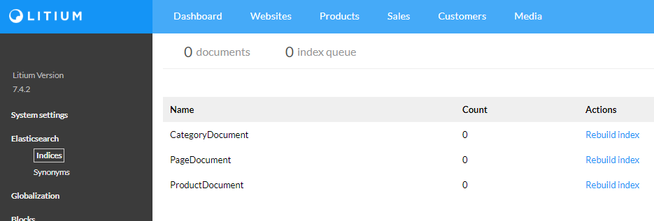

---
# Litium Search

* Add an manage synonyms in Litium Backoffice

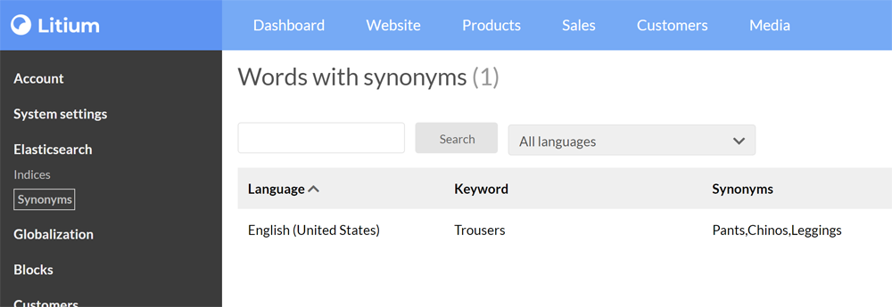

---
# DataService - Batching data

```C#
Litium.Data.DataService.CreateBatch
```

### Create, Delete and Update multiple domain objects in a single transaction

* If one operation fails, the whole batch is rolled back.

* All entities in a single batch are logged together in logging for auditing

* Bigger batches **might be slower** than small batches

    * Developers need to find the balance for batch size in the project

        _(Example, sync 5 items at a time might be optimal and 10 is actually slower)_

.footer[[Optional development task is avaliable for Data service](https://github.com/LitiumAB/Education/tree/main/Developer%20Education/Tasks/Data%20service)]

???

Example, create a baseproduct and all variants in a single transaction to avoid creating incomplete products

---
# DataService - Batching example

### `Litium.Data.DataService.CreateBatch`

```C#
var baseProduct2Delete = _baseProductService.Get("123-456");
var fieldTemplateSystemId = baseProduct2Delete.FieldTemplateSystemId;

var baseProduct = new BaseProduct("777-d1", fieldTemplateSystemId) 
{ 
    SystemId = Guid.NewGuid() 
};
var variant = new Variant("445-87", baseProduct.SystemId);

using (var db = _dataService.CreateBatch())
{
    db.Delete(baseProduct2Delete);

    db.Create(baseProduct);
    db.Create(variant); // If the variant fails the baseproduct is not created

    db.Commit();
}
```
.footer[See the full code sample on https://docs.litium.com/documentation/architecture/data-service]

---
# DataService - Querying data

```C#
Litium.Data.DataService.CreateQuery
```

## Querying direct towards database

Do not use towards public site, without implementing own [caching](https://docs.litium.com/documentation/architecture/distributed-caching)!

.footer[[Optional development task is avaliable for Data service](https://github.com/LitiumAB/Education/tree/main/Developer%20Education/Tasks/Data%20service)]

???

Caching example is done in the Redis development task

---
# DataService - Querying example

### `Litium.Data.DataService.CreateQuery`

```C#
using (var query = _dataService.CreateQuery<BaseProduct>(opt => opt.IncludeVariants()))
{
    var q = query.Filter(filter => filter
        .Bool(boolFilter => boolFilter
            .Must(boolFilterMust => boolFilterMust
                .Field("MyField", "eq", "MyValue")
                .Field("MyField2", "neq", "MyValue"))
            .MustNot(boolFilterMustNot => boolFilterMustNot
                .Id("neq", "my_new_articlenumber"))))
        .Sort(sorting => sorting
            .Field("MyField3", CultureInfo.CurrentCulture, SortDirection.Descending));

    int totalRecords = q.Count();
    List<BaseProduct> result = q
        .Skip(25)
        .Take(20)
        .ToList();
}
```

.footer[See the full code sample on <https://docs.litium.com/documentation/architecture/data-service>]

???

The querylanguage is custom but inspired by the structure in Elastic search

---
template: section

# Area: Sales

---

# SalesOrder

.footer[Read more <https://docs.litium.com/documentation/areas/sales/sales-data-modelling>]

* A _SalesOrder_ contains items (order rows) and the information required to fulfill the order, such as addresses and customer information.

* A _SalesOrder_ can contain a single _payment_ and multiple _shipments_

* Use `OrderOverviewService` to get the **`OrderOverview`** to access all _payments_, _shipments_ and _returns_ connected to a _SalesOrder_.

---

# Payment service providers (PSP)

* Handles the transfer of money from buyer to merchant

  * Charges a _commission_ for this service

* Two types

  * **Redirect** to _hosted payment pages_ (Paypal)
  
  * **Iframe** (Klarna checkout)

* PSP connections are separate applications (Litium Apps hosted in Litium cloud) that communicate with Litium over Web API

  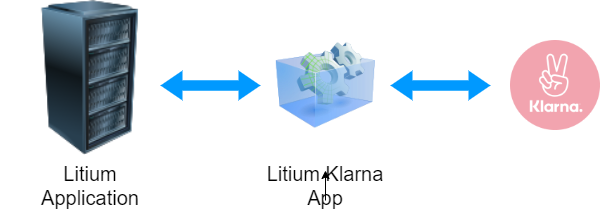

---

# Payment transactions

A payment in Litium has multiple transactions, they keep track of how much money is _Authorized_, how much of the authorized amount that is _Captured_ or _Cancelled_, and how much of the captured amount is _Refunded_.

* **Init**

* **Authorize**: The buyer has committed to pay (usually money is reserved in the buyers financial institution)

* **Capture**: Money is moved from buyer to seller - can only be done based on a authorize transaction

* **Cancel**: An authorization can also be cancelled - can only be done based on a authorize transaction

* **Refund**: A capture may be refunded back to the buyer - can only be done based on one or more capture transactions

Transactions **may** have connections to order rows but this is not required

---

# Cart

.footer[Read more <https://docs.litium.com/documentation/litium-platform/litium-field-framework-(data-modeling)/sales-data-modeling/cart>]

* Contains information needed to create an order

* Current users cart is kept in the distributed cache, it can be accessed using the service wrapper `CartContext`

  * To access `CartContext` inject and use `CartContextAccessor` or use the extension method `HttpContext.GetCartContext()`

      ```C#
        await cartContext.AddOrUpdateItemAsync(new AddOrUpdateCartItemArgs
        {
            ArticleNumber = articleNumber,
            Quantity = quantity,
        });
      ```

  * A cart can also be fetched from the distributed cache using `CartContextSessionService` if you have its _CartContextId_ (useful in Web API or outside of the .NET session).

* Abandoned carts are automatically persisted to the database and can be accessed using `CartService`

???

Id to get a CartContextSession is available in the request/cookie

The order does not get created until the payment app notifies that there is at least one guaranteed payment for the given cart, minimizing the number of waste orders in the database

Abandoned carts get persisted when the session expire (and sometimes before that)

---

# Checkout process

The checkout process starts when a visitor takes the cart to the checkout page

.center[

]

---

# Checkout process 1. - Initialize payment

.footer[Read more https://docs.litium.com/documentation/areas/sales/sales-data-modelling/payments]

.left-col[
> `TryInitializeCheckoutFlowAsync()` gets called when the checkout page is loaded - it initializes the _Checkout Process_ by:

1. Setting a payment method (if not specified the first available for the current channel)

1. Initializing a payment in the PSP by calling the _App_ of the selected payment method

1. Creating a payment transaction in Litium of type  **TransactionType::Init**
]
.right-col[

> `CalculatePaymentsAsync()` gets called **every time the cart is updated**, it:

1. Calculates the cart and updates the payment in the PSP based on the cart

1. Sends the cart to the payment _App_

1. The payment _App_ responds with a reference to the created/updated payment

1. `PaymentOverview` shows the Payments, Transactions and TransactionRows
]

---

# Checkout process 2. - Redirect/iframe to PSP

.footer[Read more https://docs.litium.com/documentation/areas/sales/order-placement/place-order]

* There is no order saved yet to database!

* Litium checkout page works independently of the PSP

  * In _hosted payment pages_, buyer is redirected to PSP site

  * In _iframe checkouts_ the iframe is embedded in the checkout page

* When buyer confirms the payment​

  * Payment is confirmed at PSP

  * PSP notifies the Litium payment addon app, which in turn notifies Litium of the availability of the payment

---

# Checkout process 3. - Payment confirmation

.footer[Read more <br/>
https://docs.litium.com/documentation/areas/sales/order-placement/place-order<br/>
https://docs.litium.com/documentation/areas/sales/order-fulfillment
]

**The order is created and saved to the database​ when PSP notifies Litium that a payment is available!**

*  The order is added with orderstate **Init** and then moved to orderstate **Confirmed**

  * Raises the _OrderConfirmed_-event that integrations can listen to and export the order to an ERP

* A new payment transaction of type _Authorize​_ is created

  * The _Authorize_ transaction has a reference to its parent _Init_-transaction created during intialization

---
# Authorize and capture payment

### Authorize

When money is reserved for a payment

* Transactions: **Init &raquo; Authorize​**

### Capture

When money is actually moved from buyer to merchant

* Transactions: **Init &raquo; Authorize &raquo; Capture​**

* Certain payment methods such as Swish / Bank direct debit moves money directly, without a reservation step (authorize transaction is created, and immediately followed by a Capture transaction)

???

Not always a credit card, example Klarna will be in Authorize state even if the buyer has selected to pay by invoice.

---
# Order fulfilment

1. Initiated when Litium gets notified that a shipment is ready (usually from an ERP integration)

1. A shipment gets created in Litium

1. Litium calculates value of the shipment and creates a _Capture_ payment transaction​

1. Litium captures money through a PSP

1. Litium notifies ERP that the shipment is ready through the ERP integration by setting _ShipmentState_ to _ReadyToShip_

1. Merchant hands the delivery over to a delivery provider (e.g. DHL) which triggers the ERP integration to notify Litium

1. Litium sets _ShipmentState_ to _Shipped_

.footer[Read more <br/>
https://docs.litium.com/documentation/areas/sales/order-fulfillment<br/>
https://docs.litium.com/documentation/areas/sales/sales-data-modelling/shipments
]

---

# State transitions

* Order states and shipment states

* States cannot be modified (since Litium 8)

* Add `StateTransitionValidationRules` to define conditions an order need to meet to move between states

* To act on state changes just register for the relevant event in [Litiums event system](https://docs.litium.com/documentation/architecture/events-handling/dot-net-events), for example the `SalesOrderConfirmed`-event

---

# State transitions - Shipment states

.center[

]

* _ReadyToShip_ is set by Litium when **all payments for a shipment are captured**

---

# State transitions - SalesOrder states

.center[

]

.footer[Read more at https://docs.litium.com/documentation/areas/sales/order-placement/state-transitions]

* In Litium an order is **Completed** when:

  * All shipments for the order has status **Shipped** and all not yet shipped products are on cancelled shipments

  * All payments for non cancelled shipments are resolved

* There is no _cancelled_ state on an order

---

# State transitions - Validate

Add `StateTransitionValidationRules` to make sure that Orders/Shipments meet the requirements needed to change state:

```C#
public class ProcessingToCompletedCondition : StateTransitionValidationRule<SalesOrder>
{
    // (non relevant code is removed from sample)

    public override ValidationResult Validate(SalesOrder entity)
    {
        var result = new ValidationResult();
        var order = _orderOverviewService.Get(entity.SystemId);

        if(!HasAllShipmentsShipped(order))
            result.AddError("Shipment", "All shipments are not shipped.");

        return result;
    }
}
```

---

# State transitions - Events

Events are triggered when orders and shipments change state.

```C#
// Sample taken the Accelerator
[Autostart]
public class SalesOrderEventListener : IAsyncAutostart
{
    // (non relevant code is removed from sample)

    ValueTask IAsyncAutostart.StartAsync(CancellationToken cancellationToken)
    {
        _eventBroker.Subscribe<SalesOrderConfirmed>(x => _stockService.ReduceStock(x.Item));
        _eventBroker.Subscribe<SalesOrderConfirmed>(x => _mailService.SendEmail(/* params */);

        return ValueTask.CompletedTask;
    }
}
```

---

# Discounts

.footer[Read more at https://docs.litium.com/documentation/areas/sales/sales-data-modelling/discounts]

.left-col[

* Regular _OrderRows_ with `OrderRowType=Discount` and negative price

* A discount may be connected to a specific OrderRow, for example a Product, Fee or Shipping row

* One product-row may have multiple discount-rows

* Calculation order​:

    1. Free gifts​
    1. Product discounts​
    1. Order level discounts​
    1. Fee and Shipping discounts
]

.right-col.table-border[

|Articlenumber|Type|Price|
| -- | -- | -- |
|A|Product|400|
|25% off A|Product Discount|-100|
|Order Discount|Order Discount|-150|
|Grand total||150|

]

---

# Order tags

* A _tag_ is a string key added to an order, shipment or payment

* Events are raised by Litium when tags are added/removed

* Use it to set values that can be checked in state transition validations

_Used in the Accelerator to handle the B2B order approval flow by setting a "Waiting for approval"-tag on orders_

---
template: task
name: Task: Setup payment and shipping

# Setup payment and shipping

---
template: section
# Accelerator front-end development

---
# Accelerator front-end tech stack

* [Foundation Zurb](https://get.foundation/) - The responsive front-end framework

* [SASS](https://sass-lang.com/) - A CSS preprocessor

* [BEM (Block, Element, Modifier)](http://getbem.com/introduction/) - A naming methodology for CSS

* [React](https://reactjs.org/) with [Redux](https://redux.js.org/) - To build the JavaScript components

* [Webpack](https://webpack.js.org/) - To build and bundle the frontend styles and scripts

.footer[
Read more at https://docs.litium.com/documentation/litium-accelerators/develop/accelerator-architecture
]

---
class: scrollable

# State on the client

To give the stateless Web API controllers access to the current Litium state (current page/channel/product) that data needs to be passed in every request.

1. In the shared view `\Shared\Framework\ClientContext.cshtml` the global object **`window.__litium.requestContext`** is written to the rendered page:

    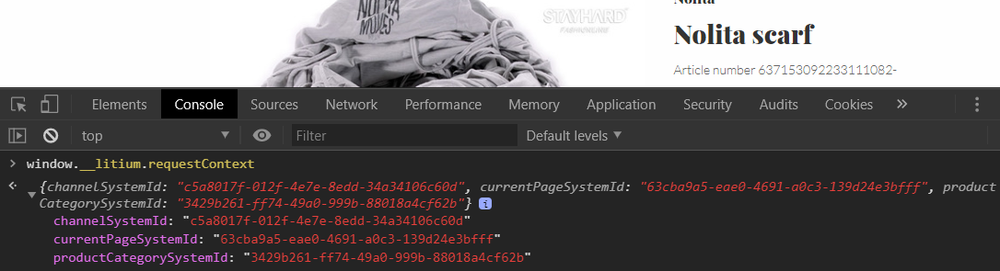

1. When the client then sends a ajax-request to the server the call is done using `Services/http.js` that attaches `window.__litium.requestContext` to the request

    ```JavaScript
    headers: {
        'litium-request-context': JSON.stringify(window.__litium.requestContext),
    }
    ```

1. `RequestModelHandler` on the server parses the object in the request and store it in `RequestModelAccessor`

    ```C#
    var siteSettingViewModel = request.Headers.GetSiteSettingViewModel();
    ```

1. A API Controller (for example `CheckoutController`) can then inject and use `RequestModelAccessor` to get state for the request
    ```C#
    public CheckoutController(RequestModelAccessor requestModelAccessor ...
    {
        ...
    ```

<br/>
<br/>
<br/>

---
template: section
# Upgrade and License

---
# Upgrading

A Litium Solution is upgraded in 3 parts:

1. The Litium platform is upgraded using NuGet update

1. The database is upgraded using the [Litium db-tool](https://docs.litium.com/documentation/get-started/database-management)

    * Use directly with a database connection or use it to generate a upgrade script.

    * No way back, backup before running the upgrade

1. Upgrading Litium Accelerator is manual

    * New release package can be used

---
# License

* Without a License file Litium will limit number of requests per minute when running the site from a machine other than localhost

* The license must cover all environments (test/prod/stage) that customers have access to

* Request a License file from https://docs.litium.com/support/request-license

---
template: section
# Next step

---
# Get certified

* A Litium Developer Certification is a personal quality mark that builds customer trust

* Litium Developer Certifications make up one part of your organizations [partner rank](https://www.litium.com/solution-partners)

* Sign up for a certification exam at [litium.com](https://www.litium.com/training-and-certification-at-litium)

---
# Resources

| What<br/><br/> | Where |
|:--|:--|
|Documentation, release notes and downloads<br/><br/>|https://docs.litium.com/<br/><br/>|
|Solution/Code samples<br/><br/>|https://github.com/litiumab/samples/<br/><br/>|
|Litium labs, early feature access<br/><br/>|https://docs.litium.com/partner/litium-labs/<br/><br/>|
|Solution help, License or technical questions<br/><br/>|https://docs.litium.com/support<br/><br/>|
|Technical failures, bug reports<br/><br/>|https://docs.litium.com/support/bugs/report-a-bug<br/><br/>|
|Litium slack<br/><br/>|https://docs.litium.com/community<br/><br/>|
|General questions and discussions<br/><br/>|https://forum.litium.com<br/><br/>|
|Feature ideas and requests<br/><br/>|https://ideas.litium.com<br/><br/>|

---
template: section
# Thank You!
