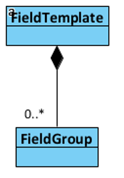

layout: true
name: section
class: center, top, section-background

<div>
    
</div>

---

template: section
# Developer Education


---

layout: true
name: task
class: center, top


# Development task

All tasks are available at https://github.com/LitiumAB/Education/ in folder _Developer education/Bookstore_

### Complete the task: 

{{content}}

---

layout: true
name: default


---

# Agenda
--
.left-col[
## Day 1

* About Litium

* Litium Accelerator

* Installation

* Architecture

* Data modelling

* Litium area Websites

* Globalization

* Dependency injection

* Security token
]
--
.right-col[
## Day 2

* Litium areas E-Commerce, PIM, Customers and Media

* Logging

* Events

* Validation

* Web API

* Searching & Batching

* React in Accelerator

* Automated testing

* Certification exam
]

---
template: default
background-image: url(Images/features.png)

---
template: default
background-image: url(Images/architecture-01.png)

???

Product Information System
Order Management System
Content Management System

---

# AddOns

## Following are some of the most frequently used AddOns
--
### Product Media Mapper 
To connect images and files to products automatically
--
### Payment providers 
Klarna, Dibs, PayEx, Adyen, PayPal, Nets, Handelsbanken Ecster, Skrill
--
### Integration kit
Starting platform to develop file based integrations towards Litium

---

background-image: url(Images/connect.png)

# Litium connect

---

# Litium is based on standard technology

* .NET Standard 2.0

* [Entity Framework Core](https://docs.microsoft.com/en-us/ef/core/index) (Microsoft/Open Source)

* [Newtonsoft JSON](https://www.newtonsoft.com/json) (Open Source)

* [AutoMapper](http://automapper.org/) (Open Source)

* [ASP.NET MVC 5](https://docs.microsoft.com/en-us/aspnet/mvc/overview/getting-started/introduction/getting-started) (Microsoft)

* [ASP.NET WebAPI 5](https://docs.microsoft.com/en-us/aspnet/web-api/overview/) (Microsoft)

* [Angular](https://angular.io/) (Google/Open Source)

???

TODO - Add additional info on usage for each bullet

---
background-image: url(Images/roadmap.png)

# Roadmap


---

template: section

# Litium Accelerator

---

# What is Litium Accelerator?

* A packaged technical solution

    * Speed up starting new projects

    * No need to build from scratch

    * Base for common functionality to start development

* Delivered as source code. 

* Start with current code snapshot and once customized the accelerator will be part of the solution. 

---
background-image: url(Images/accelerator-model.png)

# Litium Accelerator

???

BLL Allows the same business logic to be used in both Web API and in MVC Views

---

# Accelerator technical choices
--
* Design - less is more

--
* Zurb Foundation
    * …for Sites
    * …for E-mails

--
* Style
    * Component based
    * SASS 
    * _Block, Element, Modifier_ methodology (BEM)

--
* JavaScript
    * Component based
    * React
    * Webpack

???

No JQuery

BEM provides a modular structure to your CSS project. Because of its unique naming scheme, we won’t run into conflicts with other CSS names. BEM also provides a relationship between CSS and HTML. Ambiguous names are hard to maintain in the future.

https://medium.com/@dannyhuang_75970/what-is-bem-and-why-you-should-use-it-in-your-project-ab37c6d10b79

---

.left-col[
# MVC

## For most views and all routing
```
Litium.Accelerator.Mvc/Controllers

Litium.Accelerator.Mvc/Views

Litium.Accelerator/ViewModels
```

]
--
.right-col[
# React + Redux

## For dynamic views

* Compiled with WebPack

* Resources in folder: `Litium.Accelerator.Mvc/Client`

* Web API endpoints in folder: `Litium.Accelerator.Mvc/Controllers/Api`
]

---
template: section

# Installation

---

# Installation

--

## Installation of Litium is done through Visual Studio

* With or without accelerator

--
## Litium is distributed through a private NuGet-feed

* The NuGet-feed is accessed using your [Litium Docs](http://docs.litium.com) user account

* All packages that start with Litium.* are distributed as individual nuget packages

---

# Installation Pre-requisites

System requirements for local development environment are avaliable on [Litium Docs site](https://docs.litium.com/documentation/get-started/system-requirements) 

## Required

* Visual Studio 2019
* Sql Server 2016 or later **(2016 required by Litium hosting!)**
* .NET 4.7.2
* [Litium NuGet feed](https://docs.litium.com/download/litium-nuget-feed) - Requires partner account on docs.litium.com

## Optional (but recommended)

* IIS (verify that .NET development is enabled through _“Turn windows features on/off”_)
* SMTP Server
* Elastic search
* Redis

---

# NuGet package for installation

--
.left-col.center[
## Litium.Web.Setup.Complete

]

--
.right-col.center[
## Litium.Setup.Complete

]

???

Litium.Setup.complete is enough when web is not needed, for instance for the integration kit Windows service or the Litium Testproject

---
# Distribution – Add-Ons/Accelerator

## Compiled Add-Ons (e.g. payment provider addOns)

Install via NuGet packages

## Accelerator and source code Add-Ons (e.g. Integration Kit)

Download from https://docs.litium.com 

## The Litium platform and licensed Add-Ons (e.g. Accelerator and Integration Kit) can not be reused or shared after download

---
template: task

# Installation

---

template: section

# Installation review

---

# Options in Web.config

* Connectionstrings for database, Elasticsearch and Redis

* Files folder

    * Temporary files
    
    * Lucene search index files
    
    * Media files
        * In a multi server environment the media files should be shared using the CommonFilesDirectory-setting

    * Sessionstate, inProc vs StateServer
        * Use StateServer in local development to verify serialization support

    * SMTP

Read more at https://docs.litium.com/documentation/get-started/web_config

---

# Useful tools

## [localtest.me](http://readme.localtest.me/)
You can use <mysite>.localtest.me instead of using windows hosts file
Will not work offline

## [ReAttach](https://marketplace.visualstudio.com/items?itemName=ErlandR.ReAttach) 
Visual Studio addon that makes it easy to attach to IIS process for debugging.

## [Baretail](https://www.baremetalsoft.com/baretail/) 
To keep an eye on the log

## [PaperCut](https://github.com/ChangemakerStudios/Papercut)
For local email testing

---

template: section

# Demo: Litium Accelerator Frontend

???

Go through the deployed storefront of Litium Accelerator and show briefly what it includes

* Mega menu
* Categories
    * Category filter
* Search
    * Search filter
* Product page
    * Place item in cart
* Checkout
    * Place order with user registration

---

# Login to backoffice

<!-- span fix so that markdown is not formatting the url as clickable link: -->
## Login URL: http<span>://</span>mydomain/litium

Login with **your windows account username and password**

* If you don't belong to the local administrators group in windows you need to [change systemUserGroup in Web.config](https://docs.litium.com/documentation/get-started/web_config) to specify a different group to allow login locally.

* If you are on a domain it should be added to the loginname, otherwise just add a leading backslash, example:

    * With domain: **`MYORG\first.last@myorg.com`**

    * Without domain: **`\first.last@myorg.com`**

???

TODO Add instructions or link on how to change allowed login group

---

background-image: url(Images/backoffice-ui.png)

# Administration UI

* Angular

* [ASP.NET WebAPI](https://dotnet.microsoft.com/apps/aspnet/apis)

* [Signalr](https://docs.microsoft.com/en-us/aspnet/signalr/overview/getting-started/introduction-to-signalr)

* Still webforms in <br/> E-commerce (Sales) module

---

# Accelerator – What is deployed?

1. New site in websites area

1. New assortment in PIM

1. Templates and fields for PIM, Websites, Customers and Blocks 

1. Globalization artifacts
    * Channel
    * Country
    * Currency
    * Domain name
    * Market
    * Tax class

---
template: section
# Demo: Litium Backoffice

???
1. Show the dashboard and default widgets
1. Show control panel
    1. Globalization
1. Very briefly show Media
1. View the person created with the frontend order person
1. View the order created earlier in fromtend demo
1. Go through PIM
    1. Base product and variants
    1. Prices 
    1. Stock balances
    1. Publishing to channel
1. Show Websites
    1. Publishing to channel

---
template: section
# Demo: Architecture

---

background-image: url(Images/architecture-03.png)

---

# Component model

* Namespaces
    * Same namespace for domain entity and its service contract. 
    * Example: `Variant` and `VariantService` are in the same `Litium.Products` namespace

* Assembly Structure, examples
    * `Litium.Abstractions`
    * `Litium.Web.Abstractions`
    * `Litium.Web.Mvc.Abstractions`
    * `Litium.Web.WebApi.Abstractions`
    * `Litium.Web.Administration.Abstractions`

* Implementations
    * `Litium.Application`
    * `Litium.Infrastructure.MicrosoftServiceBus`

---

# Service model

* Litium contracts (Services)
    * Artifacts that have “methods” or “operations”

* Interfaces
    * Implement an interface to extend the functionality
    * Or change default functionality by extending default implementation using the [service decorator pattern](https://docs.litium.com/documentation/architecture/dependency-injection/service-decorator)
    * Example: IPriceCalculator

* Abstract Classes
    * Declare service definitions that implementation projects are **not expected to change** 
    * Example: BaseProductService

---

# Concurrency

## What is it?

* Pessimistic locking – prevent edits when an entity is being edited
* Optimistic locking – allow edit but check before save if the item has been edited since it was read

--
## Concurrency in Litium

* Optimistic concurrency is available **only in Ecommerce area**
* No other areas have concurrency checks!
* It is possible to enforce pessimistic concurrency with DistributedLock:

    ```C#
    using (_distributedLockService.AcquireLock(key, TimeSpan.FromSeconds(10)))
    {
        // Work with the locked entity
        
        // Tip: the Redis-task has a subtask for working with distributed lock
    }
    ```

???

The optimistic concurrency control approach doesn't actually lock anything - instead, it asks User A to remember what the row looked like when he first saw it, and when it's time to update it, the user asks the database to go ahead only if the row still looks like he remembers it. 

https://blogs.msdn.microsoft.com/marcelolr/2010/07/16/optimistic-and-pessimistic-concurrency-a-simple-explanation/

---
template:section
# Data Modelling

---

# Entities

### The following Litium entities support data modelling with the field framework

| PIM | Customers | Websites | Media | Globalization | 
| :-: | :-: | :-: | :-: | :-: |
| Product | Person | Website | Media | Market |
| Category | Group | Page | Channel | Folder |
| | Organization | | Block |

???

With Litium 8 additional entities from E-commerce will be added

---

# Field Framework

* Handles all “dynamic” fields (fields defined in the project)

--
* Developers can [create their own field types](https://docs.litium.com/documentation/architecture/field-framework/creating-a-custom-field-type) 
    
    * Field types are per **Installation**

    * Field instances are per **Area**

--
* The field does not need to be added to a Field template be added to an entity - The field template is not the container of fields
    
    * Skip adding a field to a template to make it hidden for editors
    
    * Consider field template as a grouping, and a way to define the display template

--
* Setup is done in the `\Src\Litium.Accelerator\Definitions\`-namespace

???

Non-dynamic fields are for example id, name and articlenumber

In Litium 4.X the field had to be in a fieldtemplate to be used

---

# Field Definition

##  Defined for each Area

* `Litium.WebSites.WebSiteArea`
* `Litium.Products.ProductArea`
* `Litium.Customers.CustomerArea`
* `Litium.Blocks.BlockArea`

Definitions are in `\Src\Litium.Accelerator\Definitions\`

Example:
```C#
new FieldDefinition<CustomerArea>("SocialSecurityNumber", SystemFieldTypeConstants.Text)
{
    CanBeGridColumn = true,
    CanBeGridFilter = true,
    MultiCulture = false,
}
```

---
# Field template

## The field definitions can be grouped into field groups and added to a field template


???

TODO - Replace image with draw.io

---
# Field template

.left-col[
```C#
new PersonFieldTemplate("B2CPersonTemplate")
{
    FieldGroups = new []
    {
        new FieldTemplateFieldGroup()
        {
            Id = "General",
            Collapsed = false,
            Fields =
            {
                SystemFieldDefinitionConstants.FirstName,
                SystemFieldDefinitionConstants.LastName,
                SystemFieldDefinitionConstants.Email,
                SystemFieldDefinitionConstants.Phone,
                "SocialSecurityNumber"
            }
        }
    }
}
```
]
.right-col[
* _Fields_ can be linked to a _field group_

* _Field groups_ are then linked to _field templates_

.center[]
]

???

TODO - Replace image with draw.io

---
# Pointer field type

* A field type that points to other entities

* Single or multi select


```C#
new FieldDefinition<BlockArea>(BlockFieldNameConstants.Link, SystemFieldTypeConstants.Pointer)
{
    Option = new PointerOption { EntityType = PointerTypeConstants.WebsitesPage }
}
```

???

TODO - Replace image with draw.io

---
# Multi field

.left-col[
* A field that is a container for other fields

* The only field that can be used as array
]

.right-col.right[]

.full-col[
```C#
new FieldDefinition<BlockArea>(BlockFieldNameConstants.Banners, 
    SystemFieldTypeConstants.MultiField)
{
    Option = new MultiFieldOption { 
        IsArray = true, 
        Fields = new List<string>() { 
            BlockFieldNameConstants.LinkText, 
            BlockFieldNameConstants.BlockImagePointer, 
            BlockFieldNameConstants.LinkToPage
        } 
    }
}
```
]

