layout: true
name: section
class: center, top, section-background

<div>
    
</div>

---

template: section
# Developer Education


---

layout: true
name: task
class: center, top


# Development task

All tasks are available at https://github.com/LitiumAB/Education/<br />in folder _Developer education/Bookstore_

### Complete the task: 

{{content}}

---

layout: true
name: default


---

# Agenda
--
.left-col[
## Day 1

* About Litium

* Litium Accelerator

* Installation

* Architecture

* Data modelling

* Litium area Websites

* Globalization

* Dependency injection

* Security token
]
--
.right-col[
## Day 2

* Litium areas E-Commerce, PIM, Customers and Media

* Logging

* Events

* Validation

* Web API

* Searching & Batching

* React in Accelerator

* Automated testing

* Certification exam
]

---
template: default
background-image: url(Images/features.png)

---
template: default
background-image: url(Images/architecture-01.png)

???

Product Information System
Order Management System
Content Management System

---

# AddOns

## Following are some of the most frequently used AddOns
--
### Product Media Mapper 
To connect images and files to products automatically
--
### Payment providers 
Klarna, Dibs, PayEx, Adyen, PayPal, Nets, Handelsbanken Ecster, Skrill
--
### Integration kit
Starting platform to develop file based integrations towards Litium

---

background-image: url(Images/connect.png)

# Litium connect

---

# Litium is based on standard technology

* .NET Standard 2.0

* [Entity Framework Core](https://docs.microsoft.com/en-us/ef/core/index) (Microsoft/Open Source)

* [Newtonsoft JSON](https://www.newtonsoft.com/json) (Open Source)

* [AutoMapper](http://automapper.org/) (Open Source)

* [ASP.NET MVC 5](https://docs.microsoft.com/en-us/aspnet/mvc/overview/getting-started/introduction/getting-started) (Microsoft)

* [ASP.NET WebAPI 5](https://docs.microsoft.com/en-us/aspnet/web-api/overview/) (Microsoft)

* [Angular](https://angular.io/) (Google/Open Source)

???

TODO - Add additional info on usage for each bullet

---
background-image: url(Images/roadmap.png)

# Roadmap


---

template: section

# Litium Accelerator

---

# What is Litium Accelerator?

* A packaged technical solution

    * Speed up starting new projects

    * No need to build from scratch

    * Base for common functionality to start development

* Delivered as source code. 

* Start with current code snapshot and once customized the accelerator will be part of the solution. 

---
background-image: url(Images/accelerator-model.png)

# Litium Accelerator

???

BLL Allows the same business logic to be used in both Web API and in MVC Views

---

# Accelerator technical choices
--
* Design - less is more

--
* Zurb Foundation
    * …for Sites
    * …for E-mails

--
* Style
    * Component based
    * SASS 
    * _Block, Element, Modifier_ methodology (BEM)

--
* JavaScript
    * Component based
    * React
    * Webpack

???

No JQuery

BEM provides a modular structure to your CSS project. Because of its unique naming scheme, we won’t run into conflicts with other CSS names. BEM also provides a relationship between CSS and HTML. Ambiguous names are hard to maintain in the future.

https://medium.com/@dannyhuang_75970/what-is-bem-and-why-you-should-use-it-in-your-project-ab37c6d10b79

---

.left-col[
# MVC

## For most views and all routing
```
Litium.Accelerator.Mvc/Controllers

Litium.Accelerator.Mvc/Views

Litium.Accelerator/ViewModels
```

]
--
.right-col[
# React + Redux

## For dynamic views

* Compiled with WebPack

* Resources in folder: `Litium.Accelerator.Mvc/Client`

* Web API endpoints in folder: `Litium.Accelerator.Mvc/Controllers/Api`
]

---
template: section

# Installation

---

# Installation

--

## Installation of Litium is done through Visual Studio

* With or without accelerator

--
## Litium is distributed through a private NuGet-feed

* The NuGet-feed is accessed using your [Litium Docs](http://docs.litium.com) user account

* All packages that start with Litium.* are distributed as individual nuget packages

---

# Installation Pre-requisites

System requirements for local development environment are avaliable on [Litium Docs site](https://docs.litium.com/documentation/get-started/system-requirements) 

## Required

* Visual Studio 2019
* Sql Server 2016 or later **(2016 required by Litium hosting!)**
* .NET 4.7.2
* [Litium NuGet feed](https://docs.litium.com/download/litium-nuget-feed) - Requires partner account on docs.litium.com

## Optional (but recommended)

* IIS (verify that .NET development is enabled through _“Turn windows features on/off”_)
* SMTP Server
* Elastic search
* Redis

---

# NuGet package for installation

--
.left-col.center[
## Litium.Web.Setup.Complete

]

--
.right-col.center[
## Litium.Setup.Complete

]

???

Litium.Setup.complete is enough when web is not needed, for instance for the integration kit Windows service or the Litium Testproject

---
# Distribution – Add-Ons/Accelerator

## Compiled Add-Ons (e.g. payment provider addOns)

Install via NuGet packages

## Accelerator and source code Add-Ons (e.g. Integration Kit)

Download from https://docs.litium.com 

## The Litium platform and licensed Add-Ons (e.g. Accelerator and Integration Kit) can not be reused or shared after download

---
template: task

# Installation

---

template: section

# Installation review

---

# Options in Web.config

* Connectionstrings for database, Elasticsearch and Redis

* Files folder

    * Temporary files
    
    * Lucene search index files
    
    * Media files
        * In a multi server environment the media files should be shared using the CommonFilesDirectory-setting

    * Sessionstate, inProc vs StateServer
        * Use StateServer in local development to verify serialization support

    * SMTP

Read more at https://docs.litium.com/documentation/get-started/web_config

---

# Useful tools

## [localtest.me](http://readme.localtest.me/)
You can use <mysite>.localtest.me instead of using windows hosts file
Will not work offline

## [ReAttach](https://marketplace.visualstudio.com/items?itemName=ErlandR.ReAttach) 
Visual Studio addon that makes it easy to attach to IIS process for debugging.

## [Baretail](https://www.baremetalsoft.com/baretail/) 
To keep an eye on the log

## [PaperCut](https://github.com/ChangemakerStudios/Papercut)
For local email testing

---

template: section

# Demo: Litium Accelerator Frontend

???

Go through the deployed storefront of Litium Accelerator and show briefly what it includes

* Mega menu
* Categories
    * Category filter
* Search
    * Search filter
* Product page
    * Place item in cart
* Checkout
    * Place order with user registration

---

# Login to backoffice

<!-- span fix so that markdown is not formatting the url as clickable link: -->
## Login URL: http<span>://</span>mydomain/litium

Login with **your windows account username and password**

* If you don't belong to the local administrators group in windows you need to [change systemUserGroup in Web.config](https://docs.litium.com/documentation/get-started/web_config) to specify a different group to allow login locally.

* If you are on a domain it should be added to the loginname, otherwise just add a leading backslash, example:

    * With domain: **`MYORG\first.last@myorg.com`**

    * Without domain: **`\first.last@myorg.com`**

???

TODO Add instructions or link on how to change allowed login group

---

background-image: url(Images/backoffice-ui.png)

# Administration UI

* Angular

* [ASP.NET WebAPI](https://dotnet.microsoft.com/apps/aspnet/apis)

* [Signalr](https://docs.microsoft.com/en-us/aspnet/signalr/overview/getting-started/introduction-to-signalr)

* Still webforms in <br/> E-commerce (Sales) module

---

# Accelerator – What is deployed?

1. New site in websites area

1. New assortment in PIM

1. Templates and fields for PIM, Websites, Customers and Blocks 

1. Globalization artifacts
    * Channel
    * Country
    * Currency
    * Domain name
    * Market
    * Tax class

---
template: section
# Demo: Litium Backoffice

???
1. Show the dashboard and default widgets
1. Show control panel
    1. Globalization
1. Very briefly show Media
1. View the person created with the frontend order person
1. View the order created earlier in fromtend demo
1. Go through PIM
    1. Base product and variants
    1. Prices 
    1. Stock balances
    1. Publishing to channel
1. Show Websites
    1. Publishing to channel

---
template: section
# Demo: Architecture

---

background-image: url(Images/architecture-03.png)

---

# Component model

* Namespaces
    * Same namespace for domain entity and its service contract. 
    * Example: `Variant` and `VariantService` are in the same `Litium.Products` namespace

* Assembly Structure, examples
    * `Litium.Abstractions`
    * `Litium.Web.Abstractions`
    * `Litium.Web.Mvc.Abstractions`
    * `Litium.Web.WebApi.Abstractions`
    * `Litium.Web.Administration.Abstractions`

* Implementations
    * `Litium.Application`
    * `Litium.Infrastructure.MicrosoftServiceBus`

---

# Service model

* Litium contracts (Services)
    * Artifacts that have “methods” or “operations”

* Interfaces
    * Implement an interface to extend the functionality
    * Or change default functionality by extending default implementation using the [service decorator pattern](https://docs.litium.com/documentation/architecture/dependency-injection/service-decorator)
    * Example: IPriceCalculator

* Abstract Classes
    * Declare service definitions that implementation projects are **not expected to change** 
    * Example: BaseProductService

---

# Concurrency

## What is it?

* Pessimistic locking – prevent edits when an entity is being edited
* Optimistic locking – allow edit but check before save if the item has been edited since it was read

--
## Concurrency in Litium

* Optimistic concurrency is available **only in Ecommerce area**
* No other areas have concurrency checks!
* It is possible to enforce pessimistic concurrency with DistributedLock:

    ```C#
    using (_distributedLockService.AcquireLock(key, TimeSpan.FromSeconds(10)))
    {
        // Work with the locked entity
        
        // Tip: the Redis-task has a subtask for working with distributed lock
    }
    ```

???

The optimistic concurrency control approach doesn't actually lock anything - instead, it asks User A to remember what the row looked like when he first saw it, and when it's time to update it, the user asks the database to go ahead only if the row still looks like he remembers it. 

https://blogs.msdn.microsoft.com/marcelolr/2010/07/16/optimistic-and-pessimistic-concurrency-a-simple-explanation/

---
template:section
# Data Modelling

---

# Entities

### The following Litium entities support data modelling with the field framework

| PIM | Customers | Websites | Media | Globalization | 
| :-: | :-: | :-: | :-: | :-: |
| Product | Person | Website | Media | Market |
| Category | Group | Page | Channel | Folder |
| | Organization | | Block |

???

With Litium 8 additional entities from E-commerce will be added

---

# Field Framework

* Handles all “dynamic” fields (fields defined in the project)

--
* Developers can [create their own field types](https://docs.litium.com/documentation/architecture/field-framework/creating-a-custom-field-type) 
    
    * Field types are per **Installation**

    * Field instances are per **Area**

--
* The field does not need to be added to a Field template be added to an entity - The field template is not the container of fields
    
    * Skip adding a field to a template to make it hidden for editors
    
    * Consider field template as a grouping, and a way to define the display template

--
* Setup is done in the `\Src\Litium.Accelerator\Definitions\`-namespace

???

Non-dynamic fields are for example id, name and articlenumber

In Litium 4.X the field had to be in a fieldtemplate to be used

---

# Field Definition

##  Defined for each Area

* `Litium.WebSites.WebSiteArea`
* `Litium.Products.ProductArea`
* `Litium.Customers.CustomerArea`
* `Litium.Blocks.BlockArea`

Definitions are in `\Src\Litium.Accelerator\Definitions\`

Example:
```C#
new FieldDefinition<CustomerArea>("SocialSecurityNumber", SystemFieldTypeConstants.Text)
{
    CanBeGridColumn = true,
    CanBeGridFilter = true,
    MultiCulture = false,
}
```

---
# Field template

## The field definitions can be grouped into field groups and added to a field template

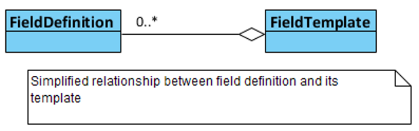

???

TODO - Replace image with draw.io

---
# Field template

* _Fields_ can be linked to a _field group_

* _Field groups_ are then linked to _field templates_

```C#
new PersonFieldTemplate("B2CPersonTemplate")
{
    FieldGroups = new []
    {
        new FieldTemplateFieldGroup()
        {
            Id = "General",
            Collapsed = false,
            Fields =
            {
                SystemFieldDefinitionConstants.FirstName,
                SystemFieldDefinitionConstants.LastName,
                SystemFieldDefinitionConstants.Email,
                SystemFieldDefinitionConstants.Phone,
                "SocialSecurityNumber"
            }
        }
    }
}
```

---
# Pointer field type

* A field type that points to other entities

* Single or multi select


```C#
new FieldDefinition<BlockArea>(BlockFieldNameConstants.Link, 
    SystemFieldTypeConstants.Pointer)
{
    Option = new PointerOption { EntityType = PointerTypeConstants.WebsitesPage }
}
```

???

TODO - Replace image with draw.io

---
# Multi field

.left-col[
* A field that is a container for other fields

* The only field that can be used as array
]

.right-col.right[]

.full-col[
```C#
new FieldDefinition<BlockArea>(BlockFieldNameConstants.Banners, 
    SystemFieldTypeConstants.MultiField)
{
    Option = new MultiFieldOption { 
        IsArray = true, 
        Fields = new List<string>() { 
            BlockFieldNameConstants.LinkText, 
            BlockFieldNameConstants.BlockImagePointer, 
            BlockFieldNameConstants.LinkToPage
        } 
    }
}
```
]

---

# Entity Model

* Each entity has its own “entity service”

* Use the service to get, create, update and delete entities

```C#
public abstract class ChannelService : IEntityService<Channel>, 
    IEntityAllService<Channel>
{
    protected ChannelService();

    public abstract void Create([NotNull] Channel channel);

    public abstract void Delete([NotNull] Channel channel);

    public abstract Channel Get(Guid systemId);
    public abstract Channel Get([NotNull] string id);
    public abstract IEnumerable<Channel> Get([NotNull] IEnumerable<Guid> systemIds);
    public abstract IEnumerable<Channel> GetAll();

    public abstract void Update([NotNull] Channel channel);
}
```

---
# Entity model - Updating an entity

1. Create an updatable copy by calling `MakeWritableClone()` on the entity _(objects are read only because cached entities should be non modifiable)_

1. Update the clone and call the update method of the respective entity service

Sample from `LoginServiceImpl`:
```C#
user = user.MakeWritableClone();
if (mustChangePasswordAtNextLogon)
{
    user.LoginCredential.PasswordExpirationDate = DateTimeOffset.UtcNow;
}
user.LoginCredential.NewPassword = newPassword;
using (_securityContextService.ActAsSystem())
{
    _personService.Update(user);
}
```

???

Makewriteableclone - Creates a clone of the object in cache
All items are read only when fetched, writeable object replaces item in cache

---
# Entity model - Relationships between entities

* Domain models relationships

    * “parent entity” – “child entity” (example baseproduct – variant, a variant cannot exist without a baseproduct)

    * “entity” – “entity”

* A parent entity has “Links” to child entities

    * The link has the SystemId of the child entity

    * The link may have additional information related to the relationship

---
# Entity model - Relationships between entities

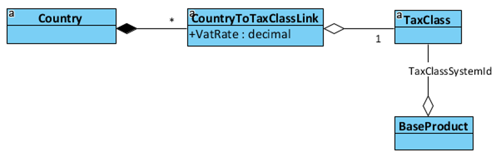

```C#
var link = new CountryToTaxClassLink(taxClass.SystemId);

// The link can have additional information related to the relationship
link.VatRate = vatRate;

country.TaxClassLinks.Add(link);
_countryService.Update((Country)country);
```

### A TaxClass can exist on its own, but CountryToTaxClassLink needs a Country to exist

Implication: TaxClass has its own TaxClassService, but there is no _CountryToTaxClassLinkService_

???

A country does not have a tax class object
Entities are connected with a link-object that can have its own data

Similar to a connecting-table in SQL Server

---

# Automapper
A convention-based object-object mapper.

### What is AutoMapper?

> “Object-object mapping works by transforming an input object of one type into an output object of a different type.”

### Why use AutoMapper?

> "Mapping code is boring. Testing mapping code is even more boring. AutoMapper provides simple configuration of types, as well as simple testing of mappings."

http://docs.automapper.org/en/stable/Getting-started.html

---

# Automapper

## Register
```C#
cfg.CreateMap<PageModel, ArticleViewModel>()
    .ForMember(x => x.Title, m => m.MapFromField(PageFieldNameConstants.Title))
    .ForMember(x => x.Text, m => m.MapFromField(PageFieldNameConstants.Text))
    .ForMember(x => x.Image, m => m.MapFrom<ImageModelResolver>());
```

## Use
```C#
var articleViewModel = pageModel.MapTo<ArticleViewModel>();
```

## Learn more
http://docs.automapper.org/

---
template:section
# Area: Websites

---

# Blocks

* Has data modelling

* Rendered inside a BlockContainer of a page

* Allow editors to easily change the page structure without developer involvement

* A Block can be Global or Local

    * **Local:** a page has its own instance of a block

    * **Global:** the block has a reference to a single global instance that can be used on multiple pages
    
---

# Websites domain model

* Pages can be “active” in different channels
* A `DraftPage` is the working copy of a Page
    * A page can only have a single `DraftPage`

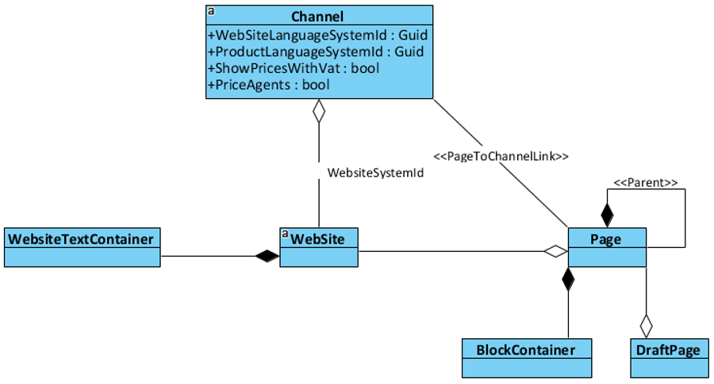

???

TODO - Convert image to draw.io

TODO - Info om WebsiteTextContainer

---
template:section
# Area: Globalization

---

# Litium.Globalization

### Entities that are common across areas

* DomainName

* TaxClass

* Language

* Currency

* Country

* Channel (has field framework)

* Market (has field framework)

---

# Market

* Programmatically a market is a group of channels

* Supports data modelling (has the field framework)

* **Products** are sold in a **market** through different **channels**

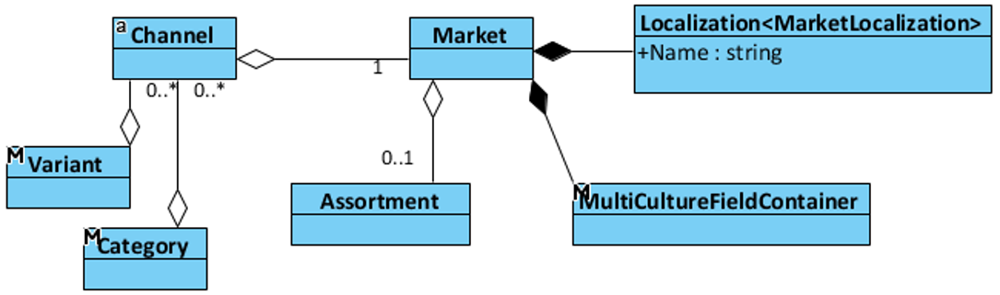

???

TODO - Change image into draw.io

---
# Channel

* Has domain names

* Belongs to a market

* May have a website

* Languags

    * Website language

    * Products language

* Defined for a list of countries

* Supports data modelling

---
# Channel


---
# Country & Tax class

* Products are defined with a Tax class

* The VAT percentage for each Tax class is defined on Country

    * All products with the same tax class has the same VAT percentage


---
template: section
# Dependency injection
---
# Dependency injection

### Dependency injection for five-year-olds
> When you go and get things out of the refrigerator for yourself, you can cause problems. You might leave the door open, you might get something Mommy or Daddy doesn't want you to have. You might even be looking for something we don't even have or which has expired.

> *What you should be doing is stating a need*, "I need something to drink with lunch," and then we will make sure you have something when you sit down to eat.

_John Munsch, 28 October 2009._

From https://en.wikipedia.org/wiki/Dependency_injection

---
# Using dependency injection in Litium

```C#
public class Needy
{
    public Needy(IIceCream iceCream) // I just want any icecream
    {
        iceCream.Serve();
    }
}

// This decorator handles the entire dependency injection registration
[Service(ServiceType = typeof(IIceCream))]
public interface IIceCream
{
    void Serve();
}

// This implementation gets sent to Needy when needed 
public class ChocolateIceCream : IIceCream
{
    public void Serve()
    {
        // Serve some chocolate icecream
    }
}
```
[Read more on Litium Docs](https://docs.litium.com/documentation/architecture/dependency-injection/service-registration)

---
# Dependency injection decorators

```C#
[Service(ServiceType = typeof(IIceCream), Lifetime = DependencyLifetime.Singleton)]
[RequireServiceImplementation]
public abstract class StockService
{
    // ...
}

```
## Lifetime
* **Singleton:** Clients will always receive that same instance from the container

* **Scoped:** For every request within a scope (usually the web request)

* **Transient:** A new instance of the component will be created each time the service is requested from the container

## RequireServiceImplementation
* When a implementation is required for the application to run

---
template: task
# Author service

---
# Service Decorator

* To change or replace default implementation

    * Usually to inject business logic

    * “Strategy pattern” in software design

* To inject new business logic

    * “Decorator pattern” in software design

* Advantages over “inheritance” (subclass)

    * Dynamically add/replace business logic

    * Reference Litium abstraction namespaces only

    * Extend without knowing which class implements interface

---
template: task
# Author service decorator

---
template: section
# Security token

---
# Security token

* In Litium, permissions are enforced by using “SecurityToken” object

    * `SecurityToken.CurrentSecurityToken` contains the security token for the logged in user

* Current token is automatically “applied” in the “code execution context”

    * Code is always executed using the currently logged in users permissions

    * If not logged in this is anonymous permission

---
# Security token

If we want to create objects in a integration job the running context will lack permissions to modify data:
```C#
var categoryToChannelLink = new CategoryToChannelLink(channelId);
category = category.MakeWritableClone();
category.ChannelLinks.Add(categoryToChannelLink);

_categoryService.Update(category);
```

--
If the current user does not have permission a `Litium.Security.AuthorizationException` is thrown when `Update()` is called

--
To solve this we can temporarily impersonate the SystemUser:
```C#
using(_securityContextService.ActAsSystem())
{
    _categoryService.Update(category);
}
```

---
# Security Token – Old API (Ecommerce)

* In the old API the token is has to be passed into every API method that requires permission enforcement

* Current SecurityToken can be constructor injected

* Can also be taken from the static SecurityToken.CurrentSecurityToken
 
Example from `Src\Litium.Accelerator\Services\CheckoutServiceImpl.cs`:
```C#
public override void ChangeDeliveryMethod(Guid deliveryMethodId)
{
    var currentOrderCarrier = _requestModelAccessor.RequestModel.Cart.OrderCarrier;
    _moduleECommerce.CheckoutFlow.AddDelivery(
        currentOrderCarrier, 
        deliveryMethodId, 
        new AddressCarrier(), 
        SecurityToken.CurrentSecurityToken);
    _moduleECommerce.Orders.CalculateOrderTotals(
        currentOrderCarrier, 
        SecurityToken.CurrentSecurityToken);
}
```

---
template: section
# Area: Ecommerce

---
# Create order

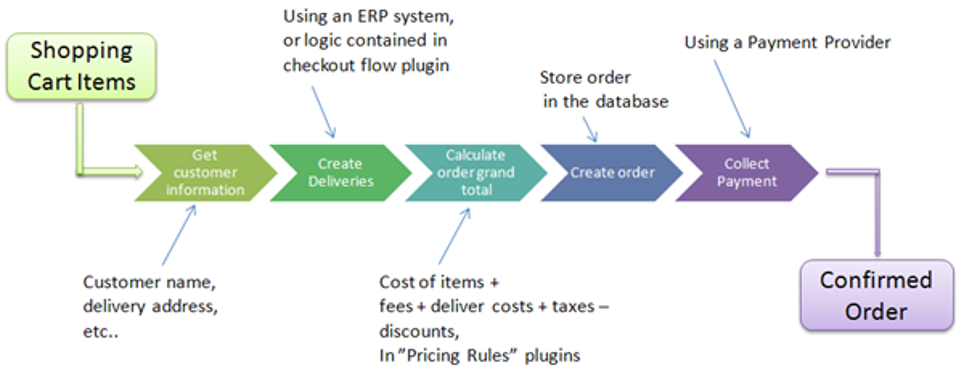

.footer[Image from https://docs.litium.com/documentation/litium-documentation/sales/checkout_flow<br/>
Read more: https://docs.litium.com/documentation/litium-documentation/sales/how-to-place-an-order]

???

TODO - Replace image with draw.io

---

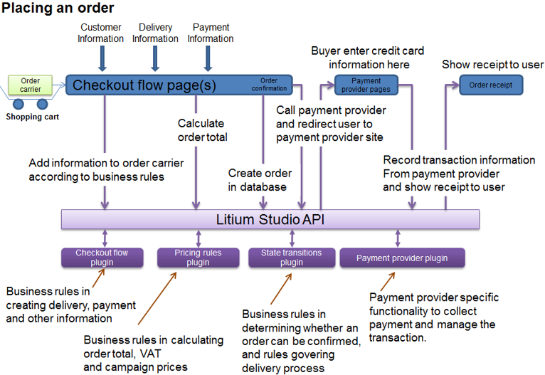

.footer[Read more: https://docs.litium.com/documentation/litium-documentation/sales/how-to-place-an-order]

---
# The shopping cart

.left-col[
* Cart object is kept in Session

* Can be persisted

    * In DB – need to be logged in

    * Per machine – using cookies

* Only article number and quantity is stored, other information might change, e.g. Prices
]
.right-col[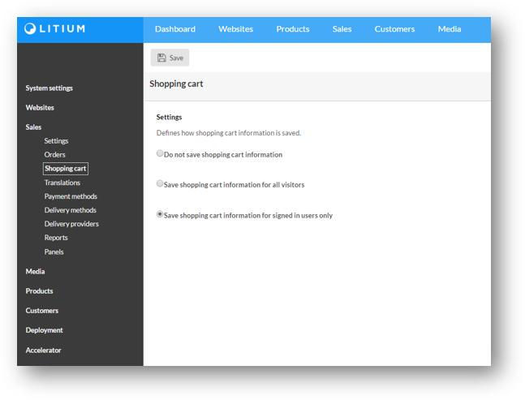]
.footer[Read more: https://docs.litium.com/documentation/litium-documentation/sales/shopping_cart]

---
# Checkoutflow info

* Checkout flow is the process of buying the items in the shopping cart

* CheckoutFlowInfo Keeps additional information required during checkout that is not saved in the Order

* Example: Used to pass CancelUrl and ReturnUrl payment providers

---
# Payment providers - collect payment

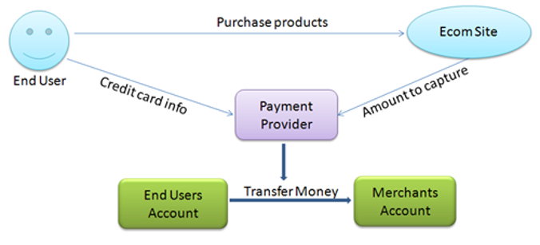

```XML
<pluginSettingx traceMode="true">
```

.footer[https://docs.litium.com/documentation/developer-guides/sales/payment-providers<br/>
https://docs.litium.com/documentation/add-ons/payments/overview]

???

Payment provider configurations has tracemode-setting to activate logging

---
background-image: url(Images/ecom-plugins.png)

# Plugins in Ecommerce

???

ECommerce plugins allow extending the ECommerce functionality and customizing its behaviour.

It is possible to have multiple implementations of plugins and create custom selectors to decide which plugin to use, see IPluginSelector link in slide for more information.

Options to extend/replace a plugin

1. Replace implementation by creating class that implements interface, LitiumStudio will automatically detect your custom implementation and will use it instead of the default implementation.

2. Write your classes by extending the classes provided by the default implementation. Usually the default implementation provide virtual methods to allow this type of extention.

https://docs.litium.com/documentation/developer-guides/sales/architecture-design
https://docs.litium.com/documentation/developer-guides/sales/architecture-design/ecommercepluginarchitecture/ipluginselector-interface-and-plugin

---
# Pricing rules

* Pricing rules defines how price of a product is determined and how the order grand total and taxes are calculated

* The pricing rules plugin use info from order price fields to do calculations

* Plugins can be replaced by custom code

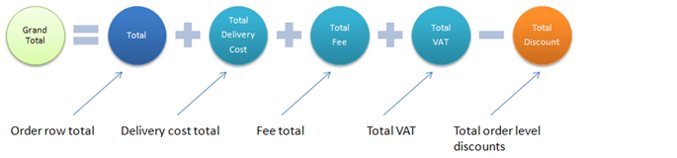

.footer[https://docs.litium.com/documentation/litium-documentation/sales/pricing_rules_1<br/>
https://docs.litium.com/documentation/litium-documentation/sales/pricing_rules_1/changing-pricing-rules]

---
# State transitions

.left-col[
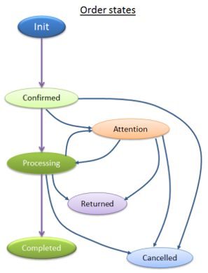    
]
.right-col[
* OrderState, DeliveryState and Paymentstate flows execute together

* PaymentState inside Litium, not possible to modify

* States can only be changed according to predefined conditions

* The implementation project can add/remove/modify states and the various conditions and transitions among them
]


.footer[https://docs.litium.com/documentation/developer-guides/sales/working_with_state_transitions
https://docs.litium.com/documentation/developer-guides/sales/architecture-design/state_transition_plugin_1]

???

States
* Set conditions that need to be fulfilled to enter or exit a state 
    * Show OrderStateBuilder.TransitionsFromInitState 287 Init to Cancelled
    * Show DeliveryStateBuilder (95) from Init to Processing: You cannot start delivery if order is not confirmed
* Entry-/Exit actions
    * OrderStateBuilder (34), status confirmed 
    * States should not be changed in entry-/exit actions!!
* Related states, such as payment pushing order forward, is setup in StateTransitionBuilder


Demo in backoffice:
* Place order
* Show Order/Delivery/Payment in BO
* Change deliverystate in backoffice from Init to Processing
    * Order will go from confirmed into processing
* Change deliverystatus from processing to delivered
    * Order will go to completed
    * Payment will go to paid

* Show how this is set up in code
    * Show code in StateTransitionBuilder

---
# State transitions – In Accelerator

.left-col[
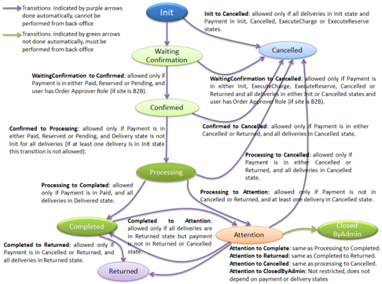    
]
.right-col[
All the transitions are done automatically based on Delivery state and Payment state transitions
]

.footer[https://docs.litium.com/documentation/litium-accelerators/develop/state-transitions/order-states-in-accelerators]

---
# Campaigns

* A campaign has a single action and zero to many conditions
    * All campaign conditions need to be met for the action to be applied
* It is possible to develop both custom campaign actions & custom campaign conditions

.footer[https://docs.litium.com/documentation/developer-guides/sales/campaigns]

---
template: section
# PIM
## Product Information Management

---
# Product structure

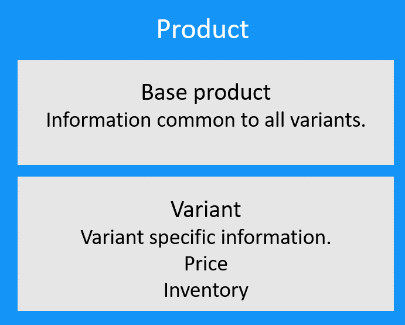

???

* The baseproduct is a container
* The variant is the buyable entity of the product
* Mention that price and stock is only set on the Variant

TODO - Convert image to draw.io

---
# Product structure

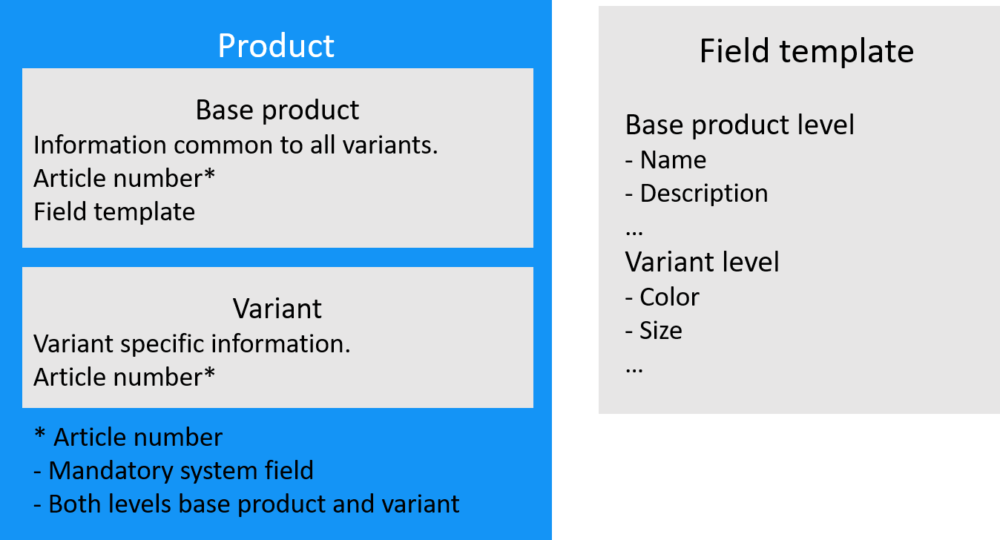

???

* Articlenumber is mandatory field on both base product and variant
* Fieldtemplates can have fields on both baseproduct and variant level

TODO - Convert image to draw.io

---
# PIM Data Model

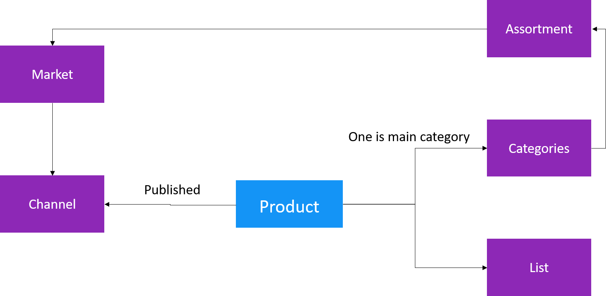

???

If multiple categories are connected then other categories have canonical to main category to avoid seo issues with duplicate content

A website can only be connected to one assortment, only products in that assortment will work with correct url’s

Show lists in Backoffice!
* A list can be used and published on a website
* A dynamic list is a static list with an event based engine that adds/removes items from the list 

---
# Relations between products and categories

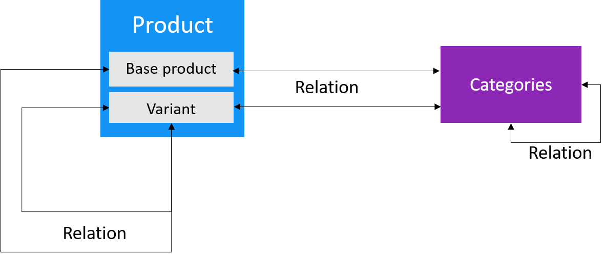

## Relationship types
* Directional “Accessories”
* Bi-directional “Similar products”

---
# Display templates

* Possible to define different templates per website

* Products can use either base product url or variant url

    * Defined on the display template

    * When variant url is used it is possible to manage how variants are grouped in listings with `IIndexDocumentMerger<Variant>`

    * In Control _Panel > Accelerator_ the default implementation has a UI to select grouping field

???

Show displaytemplate for PIM per website on Litium Demosite

---
# Common PIM extension points

### `IPriceCalculator`

Get price from ERP in complex B2B scenarios

### `IStockStatusCalculator`

Adjust so that package product inventory is the sum of its parts

---
template: task
# Pricing rules

---
template: section

# Area: Customers

---
# Customers (Relations module)

## A registry of customers, permission groups & organizations

### In standard accelerator there is no standalone user registration page

Instead a new customer is created during checkout if the _“create account”_-checkbox is selected when an order is submitted

See the `RegisterNewUser()`-method in `Src\Litium.Accelerator\Services\CheckoutServiceImpl.cs`

???

TODO - more content on customers?

---
template: section

# Area: Media

---
# Media

* Stores all images and files

* Physically the images are saved in the “Files/media”-folder

    * Use CommonFilesDirectory in multiserver scenarios

* If many products need to be enriched with images use the [media mapper addOn](https://docs.litium.com/documentation/add-ons/product-management/product-media-mapper_1)

---
template: section

# Logging

---
# Audit log

* Logging of updates in PIM

* Logging when users with access to customer or order area login to the system

    * This log has no UI


---
# Error handling

## All errors should be logged by the developer.
* Wrap with `try/catch` 

* Never `catch` without logging the exception

## Constructor inject `ILogger<Type>`
* In static classes (like extension methods) use `typeof(MyClass).Log()`

* Avoid using `this.Log()` extension method (harder to test)


---
# Event log

* Log to database, access in backoffice
    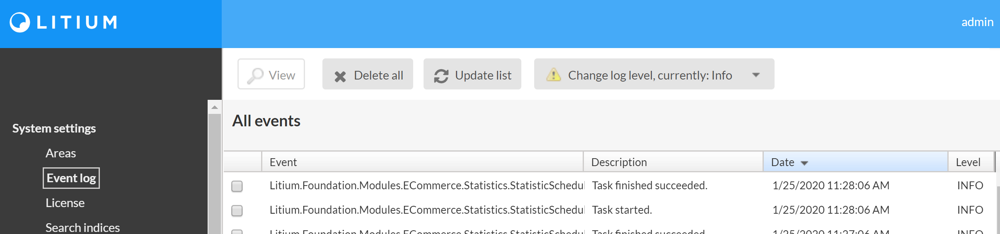

--
- Log to file
    

--
* Manage in NLog.config

---
template: section
# Events

---
# Event system

* All events are handled by `Litium.Events.EventBroker` (publish/subscribe)

    * To write your own events, or to listen to and trigger existing events

* All events are triggered by the application

* All events are local
    * i.e. in a multi server environment, update of an entity raises an event **only on current server**.

    * Adjust scope when publishing event to also send it to all servers via service bus

* You may modify the database (at own risk!) but this bypasses all change events

???

Events are used to sync cache and search index on every application/server

---
# Event system - Example

### Step 1: Declare the event class, typed with the object we need to pass:
```C#
public class MyEvent : EventArgs<Currency>, IMessage
{
    public MyEvent(Currency item) : base(item)
    {
        
    }
}
```

### Step 2: Publish the event:
```C#
public class MyEventPublisher
{
    private readonly EventBroker _eventBroker;

    public MyEventPublisher(EventBroker eventBroker)
    {
        _eventBroker = eventBroker
    }

    public void SendEvent()
    {
        _eventBroker.Publish(new MyEvent(new Currency("SEK")));
    }
}
```

### Step 3: Subscribe to the event and act when it occurs:
```C#
// The autostart decorator on the creates an instance so that our subscription
// gets registered when the application starts
[Litium.Runtime.Autostart]
public class MyEventSubscriber : IDisposable
{
    private readonly ISubscription<MyEvent> _subscription;

    public MyEventSubscriber(EventBroker eventBroker)
    {
        // Register a subscription on the EventBroker
        eventBroker.Subscribe<MyEvent>(ev => {
            // This code will execute every time MyEvent is published
            // Get the currencyobject from the event instance and act on the data
            var currency = ev.Item
        });
    }

    public void Dispose()
    {
        // Remove the event from the event broker
        _subscription.Dispose();
    }
}
```

???

* Interface `IMessage` need to be implemented by all classes that should be send as an event on the Litium.Events.EventBroker

* Overload on `_eventBroker.Publish()` that accepts scope parameter to possibly send to all applications


---
# Service bus

* Used to send messages between applications. 

* The queue is outside the application

    * Processed even if application restarts
    * Free up resources by running queue in the background

* Two different types of message queues

    * Queue – Same message queue for all applications
    * Topic – Unique queue for each application

* Required in all multi-server solutions 

* Note: Servers are updated **“Near real time”**


???

* Local on application if no Service Bus is configured, can be used to develop locally without setting up service bus

* Application = A running Litium instance connected to the same database

* Example Queue: Update smart list content (in db-table) - only one server has to do the job

* Example Topic: Remove from cache (must be done on all servers)

* By default the queue is stored in the bus for approx 1 day

* Supported: 
    * Redis
    * Windows service bus on a server 
    * Azure service bus

---
template: section
# Validation

---
# Business rules validation

```C#
public class ValidationExample : ValidationRuleBase<Currency>
{
    public override ValidationResult Validate(Currency entity, 
        ValidationMode validationMode, CultureInfo culture)
    {
        var result = new ValidationResult();
        if(entity.TextFormat != "C0")
        {
            result.AddError("TextFormat", "Need to be C0")
        }
        return result;
    }
}
```

* Inheriting `ValidationRuleBase` instead of `IValidationRule` gives a typed entity

---
template: task
# Author field

---
template: task
# Validation

---
template: section
# Web API

---
# Web API

* Useful for

    * RESTful applications

    * Integration when server is communicating with other servers.

* Service Accounts – Access services without access to Litium Backend

* **OnlyJwtAuthorization** - attribute to restrict API endpoint to only use JSON Web Token (JWT)

* **OnlyServiceAccountAuthorization** – attribute to restrict API endpoint to only allow Service Accounts

.footer[Read more: https://docs.litium.com/documentation/architecture/web-api]
 
---
# Headless API AddOn

* Platform to build use Litium E-Commerce via Web API 

* In particular to use external CMS systems with Litium as the Ecommerce processing and PIM data engine

* https://docs.litium.com/documentation/add-ons/integration/litium-headless-api

---
template: task
# Web API

---
template: section
# Searching & Batching

---
# Search

* Litium Accelerator uses Elastic Search as search engine

* Litium Backoffice searches directly against the database

--
## Search in Litium E-Commerce

* Litium E-Commerce is using the Lucene.NET search enginge both in backoffice and frontend. 

* This will be replaced with above technology in Litium version 8

.footer[Read more: https://docs.litium.com/documentation/architecture/search]
---
# Batching data

```C#
Litium.Data.DataService.CreateBatch
```

### Create, Delete and Update multiple domain objects in a single transaction

* If one operation fails, the whole batch is rolled back. 

* All entities in a single batch are logged together in logging for auditing

* Bigger batches **might be slower** than small batches

    * Developers need to find the balance for batch size in the project

        _(Example, sync 5 items at a time might be optimal and 10 is actually slower)_

???

Example, create a baseproduct and all variants in a single transaction to avoid creating incomplete products

---
# Batching example

## `Litium.Data.DataService.CreateBatch`

```C#
var baseProduct2Delete = _baseProductService.Get("123-456");
var fieldTemplateSystemId = baseProduct2Delete.FieldTemplateSystemId;

var baseProduct = new BaseProduct("777-d1", fieldTemplateSystemId) 
{ 
    SystemId = Guid.NewGuid() 
};
var variant = new Variant("445-87", baseProduct.SystemId);

using (var db = _dataService.CreateBatch())
{
    db.Delete(baseProduct2Delete);

    db.Create(baseProduct);
    db.Create(variant); // If the variant fails the baseproduct is not created

    db.Commit();
}
```
.footer[See the full code sample on https://docs.litium.com/documentation/architecture/data-service]

---
# Querying data

```C#
Litium.Data.DataService.CreateQuery
```

## Querying direct towards database

Do not use towards public site, without implementing own [caching](https://docs.litium.com/documentation/architecture/distributed-caching)!

???

Caching example is done in the Redis development task

---
# Batching example

## `Litium.Data.DataService.CreateQuery`

```C#
using (var query = _dataService.CreateQuery<BaseProduct>(opt => opt.IncludeVariants()))
{
    var q = query.Filter(filter => filter
        .Bool(boolFilter => boolFilter
            .Must(boolFilterMust => boolFilterMust
                .Field("MyField", "eq", "MyValue")
                .Field("MyField2", "neq", "MyValue"))
            .MustNot(boolFilterMustNot => boolFilterMustNot
                .Id("neq", "my_new_articlenumber"))))
        .Sort(sorting => sorting
            .Field("MyField3", CultureInfo.CurrentCulture, SortDirection.Descending));

    int totalRecords = q.Count();
    List<BaseProduct> result = q
        .Skip(25)
        .Take(20)
        .ToList();
}
```
.footer[See the full code sample on https://docs.litium.com/documentation/architecture/data-service]

---
template: task
# Data service

---
template: section
# Accelerator frontend development

---
# Front end code structure

* Component based

* ES6

* React + Redux

* [BEM](http://getbem.com/introduction/) (Block, Element, Modifier methodology) for CSS

    * Modular: Styling independent of elements type and nesting

    * Encourage reusing blocks

    * Avoids multilevel nesting and minimal CSS selectors

* Foundation Zurb

* Foundation Email

---
# React components - Rendering the Buy button

1. Buy button is added on the server in the MVC view `_VariantItem.cshtml`:
    ```Razor
    @Html.BuyButton(model => model.ProductItem, isBuyButton: true) 
    ```
    The HTML-helper used from `ProductItemViewModelHtmlExtensions` renders a HTML-tag:
    ```HTML
    <buy-button ...
    ```
1. In `index.js` on the client Litium identifies tags that are React-components (for example buy-button and minicart) and replace these tags with [Redux containers](https://redux.js.org/basics/usage-with-react/#presentational-and-container-components). The same [Redux store](https://redux.js.org/basics/store/) is injected in every component.

    ```JavaScript
    const bootstrapComponents = () => {
        if (document.getElementById('miniCart')) {
            ReactDOM.render(
                <Provider store={store}>
                    <MiniCartContainer />
                </Provider>,
                document.getElementById('miniCart')
            );
        }
        ...
    ```
1. In `BuyButton.container.js` the button is rendered, the click-event of the button triggers the add event of `Cart.action.js`:
    ```JavaScript
    import { add as addToCart } from '../Actions/Cart.action';
    ```
    
    ```JavaScript
    render() {
        return (
            <span ref={this.buttonRef}>
                <BuyButton {...this.props} 
                    onClick={(articleNumber, quantityFieldId) => this.props.addToCart(
                        this.buttonRef.current, articleNumber, quantityFieldId)} />
            </span>
        );
    }
    ```

.footer[Read more: https://docs.litium.com/documentation/litium-accelerators/develop/buy-button]
---
# React components - Clicking the Buy button

1. When a buybutton is clicked the `Add()`-method in `Cart.action.js` trigger a POST to the server:
    ```JavaScript
    return post('/api/cart/add', { articleNumber, quantity: parseInt(quantity) })
        .then(response => response.json())
        .then(cart => {
            dispatch(receive(cart));
    ```
1. After returning from the server controller `Litium.Accelerator.Mvc.Controllers.Api.CartController.Add()` the `receive`-action is triggered

1. In `Cart.reducer.js` the `CART_RECEIVE`-action updates state with fresh cart data from the server
    ```JavaScript
    switch (action.type) {
        case CART_RECEIVE:
        case CART_SHOW_INFO:
            return {
                ...state,
                ...action.payload,
            };
        default:
            return state;
    }
    ```
    `action.payload` contains the cart passed in `dispatch(receive(cart))`

1. All components that share state gets updated, for example the MiniCart-component

.footer[Read more: https://docs.litium.com/documentation/litium-accelerators/develop/buy-button]
---
# State on the client

To give the stateless Web API controllers access to the current Litium state (current page/channel/product) that data needs to be passed in every request.

1. In the shared view `\Shared\Framework\ClientContext.cshtml` the global object **`window.__litium.requestContext`** is written to the rendered page:

    

1. When the client then sends a ajax-request to the server the call is done using `Services/http.js` that attaches `window.__litium.requestContext` to the request

    ```JavaScript
    headers: {
        'litium-request-context': JSON.stringify(window.__litium.requestContext),
    }
    ```

1. `RequestModelHandler` on the server parses the object in the request and store it in `RequestModelAccessor`

    ```C#
    var siteSettingViewModel = request.Headers.GetSiteSettingViewModel();
    ```

1. A API Controller (for example `CheckoutController`) can then inject and use `RequestModelAccessor` to get state for the request
    ```C#
    public CheckoutController(RequestModelAccessor requestModelAccessor ...
    {
        ...
    ```


---
template: section
# Upgrading

---
# Upgrading

* As with installation, upgrading is done through Visual Studio

* Upgrading the database is done with a SQL-script

    * `packages\Litium.Setup.Core\tools\UpgradeToLatest.sql`

    * Can be executed with Package Manager Console in Visual Studio
        ```console
        Update-LitiumDatabase
        ```

    * No way back, backup before running the script

---
template: section
# Next step

---
# Support

## Solution related help, License or technical questions
support@litium.com 

phone: 036-210 33 30

## Technical failures, bug reports
https://docs.litium.com/support/bugs/report-a-bug

## General Litium questions and discussions
https://forum.litium.com 

.footer[Read more: https://docs.litium.com/support]

---
# License

* A license file is required to access Litium from a machine other than localhost

    * The initial installation uses a demo license which only allows requests from the local computer.

* The license must cover all environments (test/prod/stage) that customers have access to

* Request a License file from https://docs.litium.com/support/request-license

---
template: section
# GAME OVER