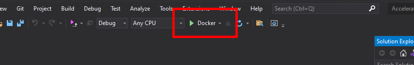
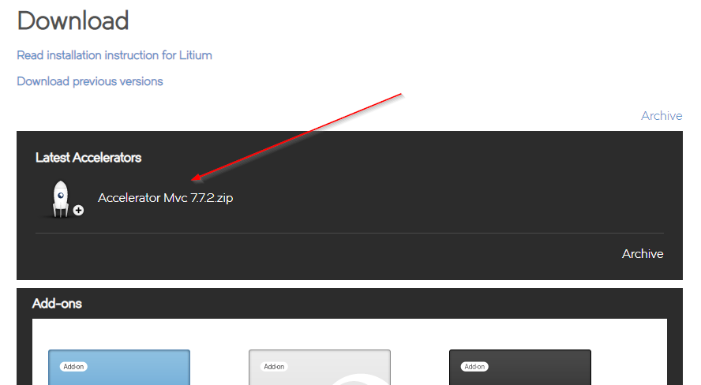

# Install Litium Accelerator

In this task we will set up a local Litium installation running in a Docker container.

> To do this task you first need to complete the [Docker task](../Docker)

Additional [installation instructions](https://docs.litium.com/documentation/litium-accelerators/install-litium-accelerator) can be found on Litium docs.

If you run into problems getting your site up and running see the [FAQ section below](#faq).

## Preparations

Check that you have completed the requirements below installed before you start.

### Required

1. Litium is only distributed through NuGet, so first  [configure the Litium NuGet feed](https://docs.litium.com/documentation/get-started/litium-packages) (requires a [Litium Docs account](https://docs.litium.com/system_pages/createlitiumaccount) with partner privileges).
1. Install [Visual Studio](https://visualstudio.microsoft.com/) for the development
1. Install [SQL Server Management Studio](https://docs.microsoft.com/sv-se/sql/ssms/download-sql-server-management-studio-ssms) to manage the database

### Optional but recommended

1. Install [Baretail](https://www.baremetalsoft.com/baretail/) to monitor the Litium logfile during development
1. Install [Git](https://git-scm.com/) to make life easier

## Install the Accelerator

1. Create a directory on your computer where you want to keep your site, for example `C:\Temp\LitiumEducation\`.
1. Start a PowerShell command prompt **in your new directory**  and run the commands below:

    ```PowerShell
    # First install the Litium Accelerator template:
    dotnet new --install "Litium.Accelerator.Templates"

    # Make sure your new directory is selected:
    cd C:\Temp\LitiumEducation

    # Install a new Accelerator site using the Litium Accelerator template
    # Adding the -test parameter will also add a test project for automated testing
    # See the test project task for additional info
    dotnet new litmvcacc -test
    ```

## Add docker support to the Accelerator

1. Configure Docker

    1. Open _Accelerator.sln_ in Visual Studio
    1. Right-click on the project `Litium.Accelerator.Mvc` and select **Add > Docker Support**
        1. If prompted select _Target OS: Linux_
    1. In the project you now get a new file called `Dockerfile` that is specified to run the `aspnet:5.0`-image. You need to change it to use the `litium:net5`-image instead since you need some additional Litium requirements (node/Gdi-image scaling and some config):

        ```PowerShell
        # Replace this line at the top of the file:
        # FROM mcr.microsoft.com/dotnet/aspnet:6.0 AS base
        # With this line:
        FROM registry.litium.cloud/runtime/litium:net6-latest AS base
        ```

        (You can find a modified `Dockerfile` in the [_Resources_-folder](Resources/Dockerfile)).
1. Add project configurations
    1. Edit the file `\Litium.Accelerator.Mvc\Litium.Accelerator.Mvc.csproj`, right before the closing `</Project>`-tag add the `<Target>`-tag below to configure the docker build:

        ```XML
            ...

            <Target Name="CreateDockerArguments" BeforeTargets="ContainerBuildAndLaunch">
                <PropertyGroup>
                    <!-- Always pull to ensure that the latest image is used -->
                    <DockerfileBuildArguments>--pull</DockerfileBuildArguments>
                    
                    <!-- Define the parameters for host folders -->
                    <DockerLitiumFiles>$(MSBuildThisFileDirectory)../files</DockerLitiumFiles>
                    <DockerLitiumLogs>$(DockerLitiumFiles)/logs</DockerLitiumLogs>
                    
                    <!-- Define volume mappings so that folders in the container are synced with 
                    folders on host. The Docker image used (defined in the Dockerfile) already contains 
                    the environment variable Litium__Folder__Local that defines files to 
                    be stored in app_data inside the container -->
                    <DockerfileRunArguments>$(DockerfileRunArguments) -v $(DockerLitiumFiles):/app_data:rw</DockerfileRunArguments>
                    <DockerfileRunArguments>$(DockerfileRunArguments) -v $(DockerLitiumLogs):/app/bin/$(Configuration)/logs:rw</DockerfileRunArguments>

                    <!-- Configure the container to use the dnsresolver-container as DNS: -->
                    <DockerfileRunArguments>$(DockerfileRunArguments) --dns 192.168.65.2</DockerfileRunArguments>
                </PropertyGroup>
            </Target>

        </Project>
        ```

1. The previous step configured logfiles to be copied from the `\logs`-folder in the container, you need to adjust the log configuration so that logs are written to this folder, adjust _logDirectory_ in the file `\Src\Litium.Accelerator.Mvc\nlog.config`:
    * From: `<variable name="logDirectory" value="${basedir}.."/>`
    * To: `<variable name="logDirectory" value="${basedir}../logs"/>`

## Configure a Litium database

1. In the previous [Docker task](../Docker) you started a container with _SQL Server_. If you did not modify the `docker-compose.yaml` file you can use SQL Server Management Studio to connect the that server with:
    - Server name: **127.0.0.1,5434**
    - Login: **sa**
    - Password: **Pass@word**
1. [Create a new empty database](https://docs.microsoft.com/en-us/sql/relational-databases/databases/create-a-database?view=sql-server-ver15#SSMSProcedure) called **LitiumEducation**
1. Start a powershell prompt in the folder where you have the `Accelerator.sln`-file and run the commands below to set up the database with the [Litium db-tool](https://docs.litium.com/documentation/get-started/database-management):

    ```PowerShell
    # Run database migrations and configure the database
    dotnet litium-db update --connection "Pooling=true;User Id=sa;Password=Pass@word;Database=LitiumEducation;Server=kubernetes.docker.internal,5434"

    # Create a new Litium backoffice admin user in the database with login admin/nimda
    dotnet litium-db user --connection "Pooling=true;User Id=sa;Password=Pass@word;Database=LitiumEducation;Server=kubernetes.docker.internal,5434" --login admin --password nimda
    ```

1. Set the connectionstring, Litium uses the standard .NET configuration system so select one of the options below to set the connection:
    - Set as environment variable in the application container. In the `Dockerfile` in Visual Studio add the line below at line 7, right after the `"EXPOSE 443"`-line

        ```PowerShell
        ENV Litium__Data__ConnectionString="Pooling=true;User Id=sa;Password=Pass@word;Database=LitiumEducation;Server=host.docker.internal,5434"
        ```

        You can find a modified `Dockerfile` in the [`_Resources_-folder](Resources/Dockerfile).
    - OR set it in the `appsettings.json` file in the Mvc-project:

        ```JSON
        "Litium": {
            "Data": {
                "ConnectionString": "Pooling=true;User Id=sa;Password=Pass@word;Database=LitiumEducation;Server=host.docker.internal,5434"
        ```

## Configure custom domain

You need to run our site on a custom domain for other Litium Apps to work. Make the changes below to run your site on `bookstore.localtest.me` instead of `localhost`.

By using a `[mysite].localtest.me`-domain it is possible to use a custom domain without having to update the windows `hosts`-file. `Localtest.me` is a public domain that points to localhost, [click here to read more](http://readme.localtest.me/).

Make the adjustment below to the Docker-section of `Litium.Accelerator.Mvc\Properties\launchSettings.json`

```JSON
// Replace with new domain:
//"launchUrl": "{Scheme}://{ServiceHost}:{ServicePort}",
"launchUrl": "{Scheme}://bookstore.localtest.me:{ServicePort}"
// Add defined ports for the application that we can connect to later:
"httpPort": 5000,
"sslPort": 5001
```

## Build and run

1. Right-click on the project `Litium.Accelerator.Mvc` and select **Set as startup project**
1. In the Build-dropdown in the toolbar select **Docker**
    
1. Press `Ctrl+F5` to build and run the application in a container 
1. If all goes well the site will start on a 404-page, add **/Litium** to the url to access Litium Backoffice login, example: [https://bookstore.localtest.me:12345/litium](https://bookstore.localtest.me:12345/litium)
    1. If for some reason your page does not start please refer to the [FAQ](#FAQ) section below
1. Login to Litium Backoffice using the admin account created earlier **(admin/nimda)**
    1. Open _Control panel (cogwheel in top right corner) > Deployment > Accelerator_
        1. Set _Name_ to _Bookstore_
        1. Set _Domain name_ to _bookstore.localtest.me_
        1. Click **Import**
            > _The import can take a couple of minutes, most of this time is spent importing data into Media. To view progress just open a new tab to https://bookstore.localtest.me:5001/Litium/UI/media, on this page you can see number of files increase in real time until it reaches 400+ files._
    1. Remove **/litium** and everything after it from the url to browse the public Accelerator website

> Note that the site will not list any products until [Litium search](../Litium%20search) is configured

## Optional extra task: Version control

Using a Git-repo is always recommended during local development to be able to track and revert changes made. Git setup is not supported during classroom training for time reasons.

1. Copy the `.gitignore`-file from the [_Resources_-folder](Resources/.gitignore) to your solution folder
1. Using Command-prompt or PowerShell
    1. Init a git repo in your solution-folder:

        ```PowerShell
        git init
        ```

    1. Add All files in the folder to Git

        ```PowerShell
        git add .
        ```

    1. Commit

        ```PowerShell
        git commit -m "Added Litium Accelerator"
        ```

1. Follow [Litiums recommended  branching strategy](https://docs.litium.com/documentation/litium-accelerators/install-litium-accelerator/maintain-the-litium-accelerator-solution) and setup a _Vanilla_-branch of the Accelerator for easier maintenance and upgrades.

## FAQ

Refer to the section below to solve common installation problems:

- **I get nuget package errors when I build my solution?**

  - Validate and re-set your nuget credentials by following the steps below

    1. Login on Litium docs and navigate to https://docs.litium.com/documentation/previous-versions/download - if your account has download permissions this page should display a link to download the latest version 7 Accelerator:
            
        If the link is not visible please contact Litium support.
        1. If the link is visible try re-setting your nuget credentials:
            1. Close Visual Studio
            1. Remove current credentials using [nuget remove source](https://docs.microsoft.com/en-us/dotnet/core/tools/dotnet-nuget-remove-source) by running the command below in a console/terminal:

                ```PowerShell
                dotnet nuget remove source Litium
                ```

            1. Re-add the NuGet credentials according to [instructions on Litium docs](https://docs.litium.com/documentation/get-started/litium-packages)
            1. Open Visual Studio and try again

- **I gett error `invalid referenc format` when I try to run my site**

  - You might have an invalid path to your solution file, verify that you have no spaces in the full path to your solution file, example:
    - Invalid: `c:\my litium site\Accelerator.sln`
    - Valid: `c:\mylitiumsite\Accelerator.sln`

- **I gett error `The line number specified for #line directive is missing or invalid` when I try to run my site**
   - See [this forum post](https://forum.litium.com/t/getting-line-number-error-after-installing-visual-studio-2022/2302/2) for a solution).

- **Pressing `CTRL+F5` launches my browser but all I see is a 404-page**

  - This is expected behaviour until you have deployed an Accelerator website, just append _/litium_ to the URL and try again
