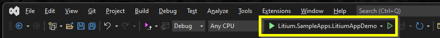
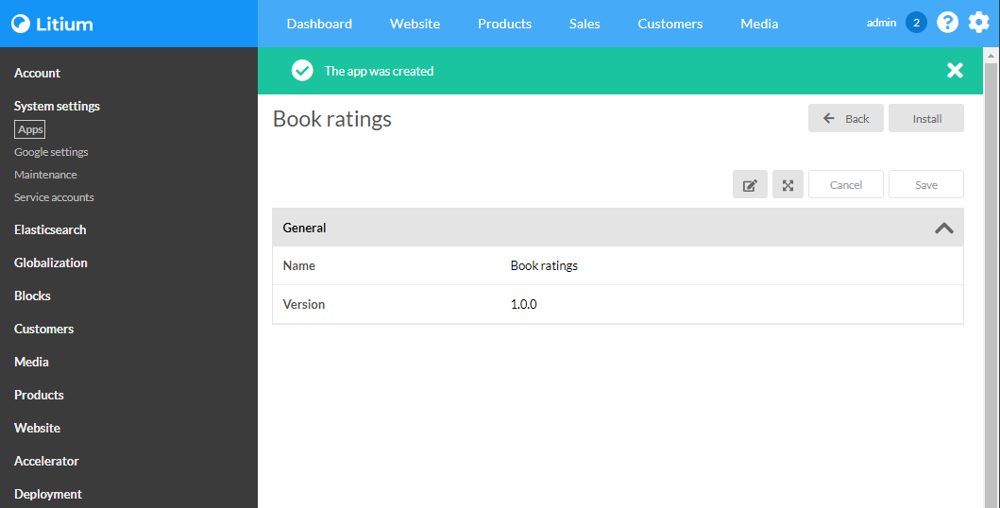

# Litium app

> To do this task you first need to complete the task [Author service decorator](../Author%20service%decorator)

To make the book ratings source as flexible as possible you will move the source of book ratings  into a Litium app. This will make it easy to replace and scale without having to re-deploy the web application.

## Create the book ratings Litium app

The new app will be based on the sample Litium App Demo.

1. Get the source code for the sample **Litium App Demo** from <https://github.com/LitiumAB/Samples>

1. Open the solution `Resources\Litium.SampleApps.LitiumAppDemo.sln` in Visual Studio and make the following adjustments

    1. In `\Litium.SampleApps.LitiumAppDemo\Properties\launchSettings.json` change applicationUrl in section _Litium.SampleApps.LitiumAppDemo_ to:

        ```JSON
        "applicationUrl": "https://bookratings.localtest.me:5050"
        ```

    1. Create a new file called RatingsApiController.cs and paste the code below to create a new api controller:

        ```C#
        using System.Threading.Tasks;
        using Litium.AppManagement;
        using Microsoft.AspNetCore.Authorization;
        using Microsoft.AspNetCore.Mvc;

        namespace Litium.SampleApps.LitiumAppDemo
        {
            // The authorize attribute below will secure the endpoint and
            // only allow connections from the Litium application where
            // this app is installed.
            [Authorize(LitiumApiConstants.LitiumSystemPolicy)]
            [Route("api/ratings")]
            public class RatingsApiController : Controller
            {
                [HttpGet("rating/{id}")]
                public async Task<IActionResult> GetFile(string id)
                {
                    var rating = string.IsNullOrEmpty(id) ? 0 : id.Length;
                    return Ok(rating);
                }
            }
        }
        ```

1. In the solution directory you will find a AppConfig-folder that is not part of the Visual Studio solution, open it and make the following adjustments:

    1. Replace content of `\AppConfig\AppMetadata.json` with (a value for _RequestedPermissions_ is required due to [a bug](https://docs.litium.com/support/bugs/bug_details?id=59573))

        ```JSON
        {
            "AppMetadata": {
                "Version": "1.0.0",
                "Id": "BookRatingsApp",
                "DisplayName": "Book ratings",
                "RequestedPermissions": [ "Function/Connect/Payments" ],
                "Subscribers":[],
                "ConfigFiles":[
                    {
                        "Id": "extendConfig.json",
                        "DisplayName": "Extend Config",
                        "Description": "This file can be uploaded from Litium Back-office."
                    }
                ]
            }
        }
        ```

    1. Replace content of `\AppConfig\Hosting.json` with

        ```JSON
        {
            "LitiumApi":{
                ".": "Litium installation that we should connect to",
                "ApiUrl": "https://bookstore.localtest.me:5001/"
            },
            "AppMetadata": {
                ".": "Url for this application",
                "AppUrl": "https://host.docker.internal:5050"
            }
        }
        ```

## Install the app

1. Run the application
    1. Select Litium.SampleApps.LitiumAppDemo in the Standard-toolbar in Visual Studio:
        
    1. Verify that your Litium application is running on url <https://bookstore.localtest.me:5001>
    1. Press `Ctrl+F5` to run the application, this should launch the app which will first create itself in your Litium application and then display the _install_-view::
    
    1. Click _Install_

> The installation will create a Service Account in Litium for your app. You should find the credentials stored by the app in the generated file `\AppConfig\LitiumApi.json`.

## Use the app to get ratings

The communication between Litium apps and the Litium application is done using Web API. When an app has been installed Litium will manage the authentication process automatically for you. All you need to do is to use `Litium.Application.Runtime.AppHttpClientFactory` to get the `HttpClient` and Litium will set the correct base-URL and authentication headers on the requests.

Make the following adjustments to the `AuthorServiceRatingsDecorator`:

> Note, the methods below are `async`, in a real project you should make the whole call-chain `async` but to keep it simple you can in this case just call `.Result` on the method response.

1. Add a reference to the `Litium.Application` package in the _Litium.Accelerator_-project:

    ```PowerShell
    <PackageReference Include="Litium.Application" Version="8.2.1" />
    ```

1. Inject `AppService` and use it to get the installed instance of your app using its id (_BookRatingsApp_).

1. Inject `AppHttpClientFactory` and call `CreateClientAsync(your app)` to create a configured `HttpClient`

1. In the controller in your app you created the rating endpoint on URL <https://bookrating.localtest.me:5050/api/ratings/rating/{id}>. Use the methods `GetAsync` and then call `ReadAsStringAsync` on the response to get a rating.

1. A finished example is avaliable in the [_Resources_-folder](Resources/AuthorServiceRatingsDecorator.cs).

## Try it out

1. Build and run your Litium application `with ctrl+F5`

1. Build and run your App with `ctrl+F5`

1. Check that you still get ratings on your books and that these ratings are coming from the app
