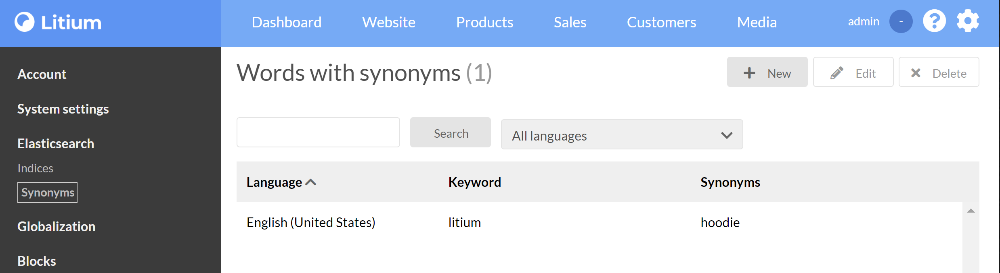

# Enable Litium Search

> To do this task you first need to complete the [Installation task](../Installation).

## Configure Litium to use Elasticsearch

Additional information on Search setup can be found on [Litium Docs site](https://docs.litium.com/documentation/architecture/litiumsearch)

To configure Elasticsearch you need to set connectionstring, prefix and synonym server in _appsettings.json_:

```JSON
"Elasticsearch": {
    /*
        The ConnectionString is used by the Litium Application to connect to Elasticsearch
        in our case this is the Elasticsearch container added in the Docker-task
    */
    "ConnectionString": "http://host.docker.internal:9200",
    "Username": null,
    "Password": null,
    /*
        By setting a value for Prefix we can use the same ElasticSearch-container for
        multiple local Litium installations, just use a unique prefix for every installation.
    */
    "Prefix": "LitiumEducation",
    /*
        To add synonym support in search connect to the Synonym server added in the Docker-task
        
        >> Synonyms are added and managed in Litium Backoffice.
        >> Litium connects to the Synonym server to register the synonyms.
        >> Elasticsearch connects to the Synonym server to retrieve the synonyms on search.
    */
    "Synonym": {
        "Server": "http://host.docker.internal:9210",
        "ApiKey": null
    }
}
```

## Test

1. When the site has restarted the **Elasticsearch** menu option is available in Litium backoffice, select it and rebuild all indices (the rebuild can be tracked in the _elasticsearch.log_ file in your solution-directory):
   
1. Select _Synonyms_ in the left menu and add a synonym so that a search for the term _Litium_  also includes hits for the term _Hoodie_
    
1. Open your public website and verify:
    1. That products are listed on the site
    1. That a search for _litium_ show hoodies in the search result.

## Troubleshooting

There are in general three places to look for any issue that you experience during setup and test:

1. Litium event log - found as the file _litium.log_ in the folder `files\logs`
1. Litium Elasticsearch log - found as the file _elasticsearch.log_ in the folder `files\logs`
1. Elasticsearch log in docker - see _Useful docker commands_ in the [Docker task](../Docker) for details on how to read

### No items are added to _index queue_ when I click _Rebuild index_

If you are running low on % available disk space Elastic will make the index write protexted. try to reconfigure using [Kibana](../Kibana):

1. Open **dev tools** in Kibana (Left menu > Dev tools)
1. Run these commands to adjust disk configuration:
    ```
    PUT _cluster/settings
    {
        "transient": {
            "cluster.routing.allocation.disk.watermark.low": "3gb",
            "cluster.routing.allocation.disk.watermark.high": "2gb",
            "cluster.routing.allocation.disk.watermark.flood_stage": "1gb",
            "cluster.info.update.interval": "1m"
        }
    }
    
    PUT /_all/_settings
    {
        "index.blocks.read_only_allow_delete": null
    }
    ```
