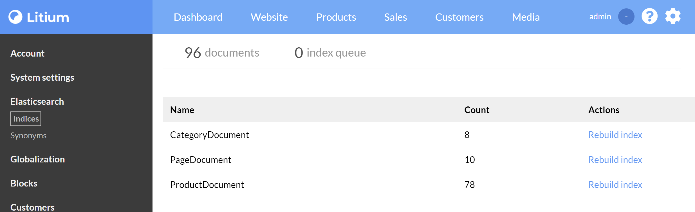

# Enable Litium Search

> To do this task you first need to complete the [Installation task](../Installation).

## Configure Litium to use Elasticsearch

Additional setup instructions can be found on [Litium Docs site](https://docs.litium.com/documentation/architecture/litiumsearch/setup-and-configure-elasticsearch)

To configure Elasticsearch you need to set connectionstring, prefix and synonym host in _appsettings.json_:
```JSON
"Elasticsearch": {
    "ConnectionString": "http://host.docker.internal:9200",
    "Username": null,
    "Password": null,
    "Prefix": "LitiumEducation",
    "Synonym": {
        "Host": "http://host.docker.internal:5000"
    }
}
```

- **ConnectionString** is used by the Litium Application to connect to Elasticsearch, in our case to the Elasticsearch container started in the [Docker task](../Docker).
- By setting a value for **Prefix** we can to use the same ElasticSearch-container for multiple local Litium installations, just use a unique prefix for every installation.
- The **Synonym host** is called by the Elasticsearch container (over _http_ not _https_). Synonyms are defined in the Litium application so call it using port 5000 that you defined in launchsettings.json in the [Installation task](../Installation).

## Test

1. When the site has restarted the **Elasticsearch** menu option is available in Litium backoffice, select it and rebuild all indices (the rebuild can be tracked in the _elasticsearch.log_ file in your solution-directory):
   
1. Open your public website and verify that products are listed on the site and that search is working

### Finding problems

There are in general three places to look for any issue that you experience during setup and test:

1. Litium event log - found as the file _litium.log_ in solution folder
1. Litium Elasticsearch log - found as the file _elasticsearch.log_ in solution folder
1. Elasticsearch log in docker - see _Useful docker commands_ in the [Docker task](../Docker) for details on how to read
