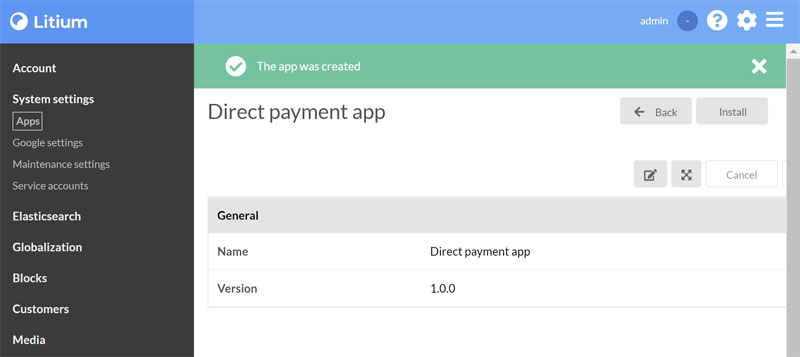
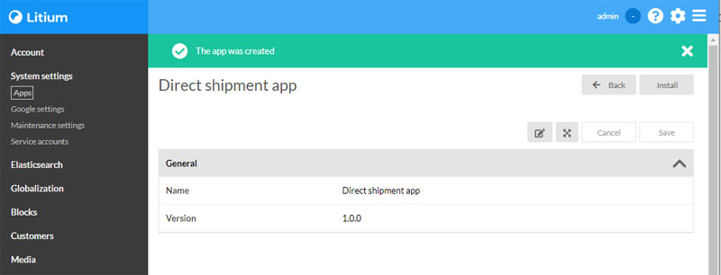

# Payment and shipping

Payment and shipment methods need to be configured for a channel for the checkout to work.

Payment and shipment providers are set up as [Litium Apps](https://docs.litium.com/documentation/litium-apps). Unlike the containers started in the [Docker task](../Docker), _Litium apps_ are unique and new containers need to be created for each Litium project. Once an app has been installed, that apps install-link will not work again.

If needed just follow the steps below to clear the app for re-installation:

1. Stop the container of the app you want to re-install
1. Open the folder where you keep the `docker-compose.yaml` for the container
1. In the `/data`-subfolder of that folder you will find a `direct-payment` and a `direct-shipment` folder, delete the one you want to clear
1. Start the container again and retry the install link

## Prepare

To be able to place orders in your site you will need to configure a payment provider and a shipping provider.

Download the following files from the [_Resources_-folder](Resources) to your computer:

* `docker-compose.yaml`
* `direct-payment-config.json`
* `direct-shipment-config.json` .

## Setup

1. Open a terminal or command window in the directory where you placed the _docker-compose.yaml_-file
1. Execute the command below to create a certificate file (additional info can be found on [Litium docs](https://docs.litium.com/documentation/litium-apps)):

    ```PowerShell
    dotnet dev-certs https -ep ./data/https/localhost.pfx -p SuperSecretPassword
    ```

    > **Optionally** replace _SuperSecretPassword_ with your own password, if you do you also need to replace the password where it is used in the `docker-compose.yaml`-file:
    >
    > ```PowerShell
    > ASPNETCORE_Kestrel__Certificates__Default__Password=SuperSecretPassword # <-- TODO Replace
    > ```
    >
    > Adjust for both _direct-payment_ and _direct-shipment_

1. Run the command below to start all containers needed to run Litium locally

    ```console
    docker-compose up
    ```

    Ignore the _"WARNING: Found orphan containers..."_.
    
    Tips on troubleshooting docker containers can be found in the [Docker task](../Docker)

1. The following containers gets started

    | Container | Port |
    | -- | -- |
    | Direct payment | 10011 |
    | Direct shipment | 10021 |

## Add payments

An app container for [Direct payment](https://docs.litium.com/documentation/litium-apps/direct-payment) was created earlier when you did the [Docker task](../Docker).

Follow these steps to create and configure the app:

1. To create the app just navigate to the Direct payment app at <https://localhost:10011>, this will open the installation view in backoffice of your Litium application:

    

1. Click install in the above view
1. In the next view click _Select file_ under _Configuration_ and select the file `direct-payment-config.json` that you downloaded earlier.
1. Click save

## Add shipping

An app container for [Direct shipment](https://docs.litium.com/documentation/litium-apps/direct-shipment) was created earlier when you did the [Docker task](../Docker).

Follow these steps to create and configure the app:

1. To create the app just navigate to the Direct payment app at <https://localhost:10021>, this will open the installation view in backoffice of your Litium application:

    

1. Click install in the above view
1. In the next view click _Select file_ under _Configuration_ and select the file `direct-shipment-config.json` that you downloaded earlier.
1. Click save

## Configure channel

In the control panel in Litium backoffice select _Globalization > Channels_

1. Edit your _Bookstore_-channel
1. Select the _Countries_-tab
1. Sweden should already be available otherwise add it as country
1. Click _Add payment method_ and select _DirectPayment:DirectPay_
1. Click _Add shipping method_ and select both _DirectShipment:expressPackage_ and _DirectShipment:standardPackage_
1. Click save

## Try it out

1. Navigate to your public website
1. Add some items in cart and navigate to checkout
1. Verify that both delivery and payment mehods are available in checkout
